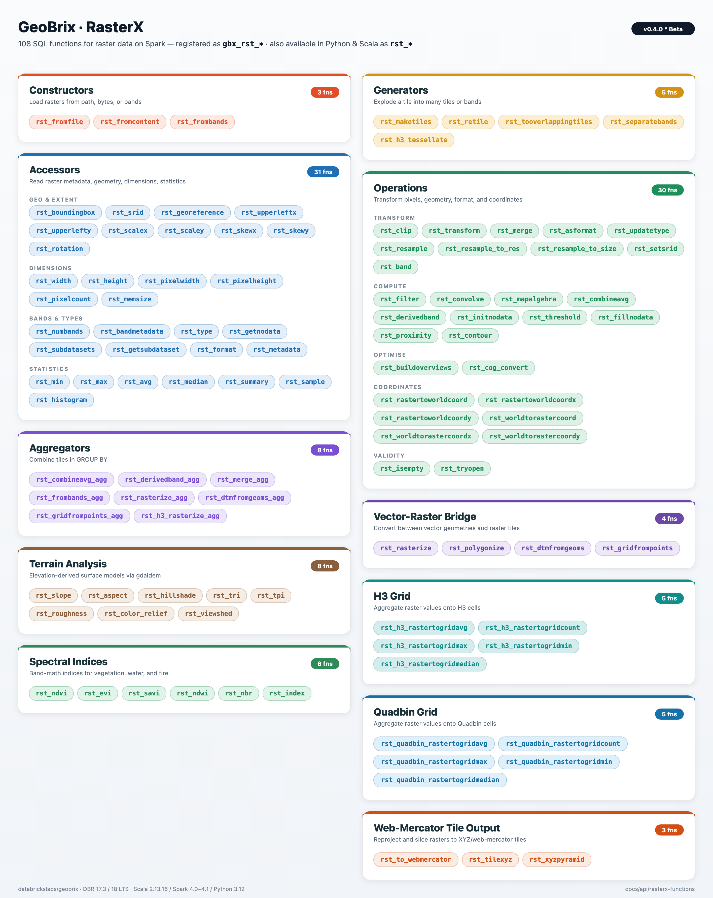

import Tabs from '@theme/Tabs';
import TabItem from '@theme/TabItem';
import CodeFromTest from '@site/src/components/CodeFromTest';
import Tier from '@site/src/components/Tier';
import rasterxCode from '!!raw-loader!../../tests/python/api/rasterx_functions.py';
import pyrxCode from '!!raw-loader!../../tests/python/api/pyrx_functions.py';
import rasterxSqlCode from '!!raw-loader!../../tests/python/api/rasterx_functions_sql.py';
import packagesExamples from '!!raw-loader!../../tests/python/packages/examples.py';
import rasterxScalaCode from '!!raw-loader!../../tests/scala/packages/RasterxPackageExamples.scala';

# RasterX Function Reference

RasterX functions run in two execution tiers. Most are available in both the **lightweight** (pure-Python `pyrx`) and **heavyweight** (`rasterx`) tiers (badged per function below); some are heavyweight-only. See [Choosing an Execution Tier](./execution-tiers) for the comparison and the lightweight install.


Complete reference for all RasterX functions with detailed descriptions, parameters, return values, and examples.

## Overview

RasterX is GeoBrix's raster data processing package, providing comprehensive tools for working with raster datasets such as satellite imagery, elevation models, and other gridded spatial data. It is a refactor and improvement of Mosaic raster functions, extended in v0.4.0 with terrain analysis, spectral indices, vector-raster bridging, web-mercator tile output, and quadbin grid aggregations. Since the Databricks product does not (yet) support anything built-in specifically for raster processing, RasterX provides a gap-filling capability for raster operations on the Databricks platform.

## Key Features

- **GDAL-Powered**: Leverages GDAL for robust raster format support
- **Distributed Processing**: Built on Spark for scalable raster operations
- **Multiple Format Support**: GeoTIFF, COG, NetCDF, and other GDAL-supported formats
- **Metadata Extraction**: Comprehensive raster metadata access
- **Raster Operations**: Clipping, resampling, transformations, map algebra
- **Band Operations**: Multi-band raster support, single-band extraction
- **Terrain Analysis**: Slope, aspect, hillshade, TRI, TPI, roughness, color-relief
- **Spectral Indices**: EVI, SAVI, NDWI, NBR, NDVI, plus a generic dispatcher
- **Vector-Raster Bridge**: Rasterize geometries, polygonize value regions
- **Tile Publishing**: Web-mercator XYZ tile generation (PNG / JPEG / WebP)
- **Grid Aggregations**: H3 and CARTO quadbin v0 cell aggregations

## Function Categories

RasterX exposes 87+ SQL functions (registered as `gbx_rst_*`; available in Python and Scala as `rst_*`), organized into the following categories (see [rasterx/functions.scala](https://github.com/databrickslabs/geobrix/blob/main/src/main/scala/com/databricks/labs/gbx/rasterx/functions.scala)):



- **Accessor Functions**: Read raster properties and metadata (bounds, dimensions, CRS, bands, pixel size, georeference, format, type, NoData, subdatasets, summary, etc.)
- **Aggregator Functions**: Combine or merge rasters in group-by (combineavg_agg, derivedband_agg, merge_agg)
- **Constructor Functions**: Create or load rasters from paths, binary content, or bands
- **Generator Functions**: Produce multiple tiles or bands (h3_tessellate, maketiles, retile, separatebands, tooverlappingtiles)
- **Grid Functions (H3)**: Aggregate raster values to H3 cells (rastertogrid avg/count/max/min/median)
- **Grid Functions (quadbin)**: Aggregate raster values to CARTO quadbin v0 cells (rastertogrid avg/count/max/min/median)
- **Operations**: Transform and analyze rasters (clip, transform, merge, asformat, ndvi, filter, convolve, map algebra, coordinate conversion, isEmpty, tryOpen, initNoData, updateType, combineavg, derivedband)
- **Web-Mercator Tile Output**: Reproject to EPSG:3857 and emit slippy-map XYZ tiles (to_webmercator, tilexyz, xyzpyramid)
- **Vector-raster bridge**: Burn polygons into rasters and trace contiguous regions back to polygons (rasterize, polygonize)
- **Terrain Analysis**: DEM-derived surfaces from `gdal.DEMProcessing` (slope, aspect, hillshade, TRI, TPI, roughness, color relief)
- **Spectral Indices**: Multi-band satellite math (EVI, SAVI, NDWI, NBR, plus the generic `rst_index` dispatcher)

## Tile payload

Every RasterX function returns a tile whose `raster` field is a **self-contained, in-memory raster** (GTiff by default) — safe to serialize between Spark stages and executors, persist to Delta, hand off to `rasterio` / `gdal`, or write back out via the `gdal` writer. The bytes are never an XML reference to a per-executor `/vsimem/` tempfile or to a path that only exists on the producing node.

Functions that internally build via an intermediate VRT — `gbx_rst_merge`, `gbx_rst_merge_agg`, `gbx_rst_frombands`, `gbx_rst_combineavg`, `gbx_rst_combineavg_agg`, `gbx_rst_derivedband`, `gbx_rst_derivedband_agg` — materialize the result to GTiff before returning, so downstream stages on different executors see real raster bytes. Inspect a tile's payload format from `tile.metadata.driver`; for any of the functions above, it will read `GTiff` (not `VRT`). See [Beta Release Notes](../beta-release-notes#whats-new-in-v030) for the v0.3.0 correctness fix that introduced this invariant. See [Tile structure](./tile-structure) for the full tile-struct schema.

## Setup

Pick your execution tier and run this once. Both tiers alias the module as `rx`, so every example below is identical regardless of tier — only this setup differs. (See [Choosing an Execution Tier](./execution-tiers) for the comparison.)

<Tabs groupId="gbx-tier" queryString="tier">
<TabItem value="lightweight" label="Lightweight (pyrx)">

<CodeFromTest
  language="python"
  title="Lightweight setup (pyrx)"
  source="docs/tests/python/api/pyrx_functions.py"
  testFile="python/geobrix/test/pyrx/test_docs_examples.py"
  functionName="pyrx_setup_example"
  outputConstant="pyrx_setup_example_output"
  code={pyrxCode}
/>

</TabItem>
<TabItem value="heavyweight" label="Heavyweight (rasterx)">

<CodeFromTest
  language="python"
  title="Heavyweight setup (rasterx)"
  source="docs/tests/python/api/rasterx_functions.py"
  testFile="docs/tests/python/api/test_rasterx_functions.py"
  functionName="rasterx_setup_example"
  outputConstant="rasterx_setup_example_output"
  code={rasterxCode}
/>

After registering RasterX, create the SQL view so the SQL examples below can use `FROM rasters`:

<CodeFromTest
  language="sql"
  title="SQL view setup"
  source="docs/tests/python/api/rasterx_functions_sql.py"
  testFile="docs/tests/python/api/test_rasterx_functions_sql.py"
  functionName="RASTERX_SQL_SETUP"
  outputConstant="RASTERX_SQL_SETUP_output"
  code={rasterxSqlCode}
/>

</TabItem>
</Tabs>

## Usage Examples

### Python/PySpark

These examples assume your tier is set up as above (imported as `rx`, and `register(spark)` called for the SQL examples).

<CodeFromTest
  code={packagesExamples}
  language="python"
  source="docs/tests/python/packages/examples.py"
  testFile="docs/tests/python/packages/test_examples.py"
  functionName="rasterx_basic_usage"
  outputConstant="rasterx_basic_usage_output"
/>

### Scala

<CodeFromTest
  code={rasterxScalaCode}
  language="scala"
  source="docs/tests/scala/packages/RasterxPackageExamples.scala"
  testFile="docs/tests/scala/packages/RasterxExamplesDocTest.scala"
  functionName="RASTERX_SCALA_USAGE"
  outputConstant="RASTERX_SCALA_USAGE_output"
/>

### SQL

<CodeFromTest
  code={packagesExamples}
  language="sql"
  source="docs/tests/python/packages/examples.py"
  testFile="docs/tests/python/packages/test_examples.py"
  functionName="SQL_RASTERX_USAGE"
  outputConstant="SQL_RASTERX_USAGE_output"
/>

---

:::note SQL examples
Examples on this page use **SQL**, where RasterX functions are prefixed with **`gbx_`** (e.g. `gbx_rst_boundingbox`, `gbx_rst_width`). For Python and Scala usage and more tips, see the [Python](./python), [Scala](./scala), and [SQL](./sql) API pages.
:::

## Heavyweight-only functions

These functions are available only in the heavyweight tier (not yet in the lightweight `pyrx` tier):

### Accessors & statistics

| Function | Purpose |
|---|---|
| `rst_avg` | per-band average pixel value |
| `rst_bandmetadata` | band metadata map |
| `rst_format` | GDAL format name |
| `rst_georeference` | geotransform parameters as a map |
| `rst_getsubdataset` | extract a named subdataset |
| `rst_max` | per-band maximum pixel value |
| `rst_median` | per-band median pixel value |
| `rst_memsize` | in-memory size in bytes |
| `rst_min` | per-band minimum pixel value |
| `rst_pixelcount` | total pixel count |
| `rst_rotation` | rotation in radians |
| `rst_skewx` | geotransform row rotation (X skew) |
| `rst_skewy` | geotransform column rotation (Y skew) |
| `rst_subdatasets` | list of subdataset names |
| `rst_summary` | statistical summary of values |
| `rst_histogram` | per-band bucket counts |

### Constructors

| Function | Purpose |
|---|---|
| `rst_fromfile` | load a raster from a file path |
| `rst_frombands` | assemble a raster from an array of band tiles |
| `rst_dtmfromgeoms` | TIN/Delaunay DTM from Z-valued points |
| `rst_gridfrompoints` | IDW-interpolated Float64 grid from points |

### Coordinates

| Function | Purpose |
|---|---|
| `rst_rastertoworldcoord` | pixel-to-world as a struct |
| `rst_worldtorastercoord` | world-to-pixel as a struct |

### Operations

| Function | Purpose |
|---|---|
| `rst_asformat` | convert to another GDAL format |
| `rst_combineavg` | average multiple tiles |
| `rst_merge` | merge tiles into a mosaic |
| `rst_tryopen` | validate that a raster opens |
| `rst_setsrid` | stamp an EPSG code (no reprojection) |
| `rst_band` | extract a single band as a new tile |
| `rst_buildoverviews` | add pyramid overview levels |
| `rst_sample` | sample pixel values at a geometry |

### Generators & tiling

| Function | Purpose |
|---|---|
| `rst_h3_tessellate` | tessellate a raster to H3 cells |

### Web-mercator tile output

| Function | Purpose |
|---|---|
| `rst_tilexyz` | render one web-mercator XYZ tile |
| `rst_xyzpyramid` | explode into one row per XYZ tile across zooms |

### Grid aggregation (H3)

| Function | Purpose |
|---|---|
| `rst_h3_rastertogridavg` | mean pixel value per H3 cell |
| `rst_h3_rastertogridcount` | pixel count per H3 cell |
| `rst_h3_rastertogridmax` | max pixel value per H3 cell |
| `rst_h3_rastertogridmin` | min pixel value per H3 cell |
| `rst_h3_rastertogridmedian` | median pixel value per H3 cell |

### Grid aggregation (quadbin)

| Function | Purpose |
|---|---|
| `rst_quadbin_rastertogridavg` | mean pixel value per quadbin cell |
| `rst_quadbin_rastertogridcount` | pixel count per quadbin cell |
| `rst_quadbin_rastertogridmax` | max pixel value per quadbin cell |
| `rst_quadbin_rastertogridmin` | min pixel value per quadbin cell |
| `rst_quadbin_rastertogridmedian` | median pixel value per quadbin cell |

### Aggregators

| Function | Purpose |
|---|---|
| `rst_combineavg_agg` | average tiles per group |
| `rst_derivedband_agg` | apply a Python UDF to tiles per group |
| `rst_merge_agg` | merge tiles per group |
| `rst_frombands_agg` | assemble ordered per-band rows per group |
| `rst_rasterize_agg` | burn geom/value rows into one tile per group |
| `rst_dtmfromgeoms_agg` | TIN DTM per group from one point per row |
| `rst_gridfrompoints_agg` | IDW grid per group from one point per row |

### Spectral indices

| Function | Purpose |
|---|---|
| `rst_index` | generic index dispatcher by name |

### Analysis

| Function | Purpose |
|---|---|
| `rst_cog_convert` | re-layout as a Cloud Optimized GeoTIFF |
| `rst_contour` | extract contour LineString features |
| `rst_proximity` | distance-to-source surface |
| `rst_viewshed` | binary viewshed from a DEM and observer |

## VRT Python pixel functions (heavyweight tier)

`gbx_rst_combineavg`, `gbx_rst_combineavg_agg`, `gbx_rst_derivedband`, and `gbx_rst_derivedband_agg` evaluate a Python expression on each pixel via GDAL's [VRT Python pixel-function API](https://gdal.org/en/stable/drivers/raster/vrt.html#using-derived-bands-with-pixel-functions-in-python). That API is gated behind the GDAL config option `GDAL_VRT_ENABLE_PYTHON`, which **GeoBrix sets to `NO` at executor startup** (see [Security - Restrict GDAL drivers](../security#6-vrt-python-pixel-functions-off-by-default-by-design)). When you call one of the four functions above, GeoBrix flips the option to `YES` for the duration of that call only — via the internal `GDALManager.withVrtPython` bracket — and restores `NO` immediately on return. You don't need to set anything on the cluster or in your notebook to use the built-in functions.

### When you need to enable it yourself

If you're invoking the GDAL Python bindings (`from osgeo import gdal`) **directly** — outside the built-in RasterX functions — and you read a VRT that declares a `<PixelFunctionLanguage>Python</...>` band, you'll get an empty/null read unless you enable the option in the same process. Pick one of:

**Python — programmatic, scoped to your read.** Recommended in all cases. Mirrors what GeoBrix does internally, works for both driver-side `pyspark.sql` calls and inside `mapPartitions` / `mapInPandas` UDFs that load VRT-with-pyfunc via `osgeo.gdal`, and survives interleaving with GeoBrix built-in calls (each GeoBrix call resets the option to `NO` on exit, so re-set it on every read):

```python
from osgeo import gdal

gdal.SetConfigOption("GDAL_VRT_ENABLE_PYTHON", "YES")
try:
    ds = gdal.Open("/path/to/your/vrt-with-pixel-function.vrt")
    arr = ds.GetRasterBand(1).ReadAsArray()
    ds = None
finally:
    gdal.SetConfigOption("GDAL_VRT_ENABLE_PYTHON", "NO")
```

**Cluster env var — for Python-worker processes only.** Setting `spark.executorEnv.GDAL_VRT_ENABLE_PYTHON YES` on the cluster works for Python UDF workers (a separate process from the JVM, where GDAL initializes from env vars). It does **not** help JVM-side reads — GeoBrix calls `gdal.SetConfigOption("GDAL_VRT_ENABLE_PYTHON", "NO")` at executor JVM startup, and `SetConfigOption` takes precedence over the env var. Prefer the programmatic form above unless you have a strong reason to globally enable.

**Scala / JVM code.** If you're writing custom Spark expressions that consume Python-pixel VRTs, wrap the read/translate in the same helper GeoBrix uses internally — it refcounts the option so concurrent tasks on the same executor JVM compose safely:

```scala
import com.databricks.labs.gbx.rasterx.gdal.GDALManager

val result = GDALManager.withVrtPython {
    val ds = org.gdal.gdal.gdal.Open(vrtPath)
    // ... GDAL reads / translates here see the Python pixel function ...
    ds
}
```

### Trusted-modules variant

GDAL also accepts `GDAL_VRT_ENABLE_PYTHON=TRUSTED_MODULES` plus a `GDAL_VRT_PYTHON_TRUSTED_MODULES` allowlist if you want pixel-function code restricted to specific Python module prefixes. GeoBrix uses the plain `YES` form because the pixel-function source is constructed in-process from trusted (geobrix-generated) strings, never from user-supplied VRT XML on disk. If your custom code path reads VRTs whose `<PixelFunctionCode>` originates from less-trusted sources, switch to the `TRUSTED_MODULES` form and allowlist only what you intend to load.

## Accessor Functions

Functions to read raster properties and metadata (29 total).

### rst_avg

<Tier heavy/>

**Signature:** `rst_avg(tile: Column): Column` — Per-band average pixel values.

**SQL:**

<CodeFromTest language="sql" source="docs/tests/python/api/rasterx_functions_sql.py" testFile="docs/tests/python/api/test_rasterx_functions_sql.py" functionName="rst_avg_sql_example" outputConstant="rst_avg_sql_example_output" code={rasterxSqlCode} />

### rst_bandmetadata

<Tier heavy/>

**Signature:** `rst_bandmetadata(tile: Column, band: Column): Column` — Band metadata map.

**SQL:**

<CodeFromTest language="sql" source="docs/tests/python/api/rasterx_functions_sql.py" testFile="docs/tests/python/api/test_rasterx_functions_sql.py" functionName="rst_bandmetadata_sql_example" outputConstant="rst_bandmetadata_sql_example_output" code={rasterxSqlCode} />

### rst_boundingbox

<Tier both/>

**Signature:** `rst_boundingbox(tile: Column): Column` — Bounding box geometry.

**SQL:**

<CodeFromTest language="sql" source="docs/tests/python/api/rasterx_functions_sql.py" testFile="docs/tests/python/api/test_rasterx_functions_sql.py" functionName="rst_boundingbox_sql_example" outputConstant="rst_boundingbox_sql_example_output" code={rasterxSqlCode} />

### rst_format

<Tier heavy/>

**Signature:** `rst_format(tile: Column): Column` — GDAL format name.

**SQL:**

<CodeFromTest language="sql" source="docs/tests/python/api/rasterx_functions_sql.py" testFile="docs/tests/python/api/test_rasterx_functions_sql.py" functionName="rst_format_sql_example" outputConstant="rst_format_sql_example_output" code={rasterxSqlCode} />

### rst_georeference

<Tier heavy/>

**Signature:** `rst_georeference(tile: Column): Column` — Georeference parameters as a map.

The result is a **MapType** with the following keys, corresponding to [GDAL's 6-element geotransform](https://gdal.org/en/stable/tutorials/geotransforms_tut.html):

| Key | Geotransform index | Meaning |
|-----|--------------------|---------|
| `upperLeftX` | GT(0) | X of the upper-left corner of the upper-left pixel |
| `upperLeftY` | GT(3) | Y of the upper-left corner of the upper-left pixel |
| `scaleX` | GT(1) | Pixel width (west–east resolution) |
| `scaleY` | GT(5) | Pixel height (north–south resolution; often negative for north-up) |
| `skewX` | GT(2) | Row rotation (typically 0) |
| `skewY` | GT(4) | Column rotation (typically 0) |

See the [GDAL geotransform tutorial](https://gdal.org/en/stable/tutorials/geotransforms_tut.html) and [raster data model](https://gdal.org/en/stable/user/raster_data_model.html) for details.

**SQL:**

<CodeFromTest language="sql" source="docs/tests/python/api/rasterx_functions_sql.py" testFile="docs/tests/python/api/test_rasterx_functions_sql.py" functionName="rst_georeference_sql_example" outputConstant="rst_georeference_sql_example_output" code={rasterxSqlCode} />

### rst_getnodata

<Tier both/>

**Signature:** `rst_getnodata(tile: Column): Column` — NoData values per band.

**SQL:**

<CodeFromTest language="sql" source="docs/tests/python/api/rasterx_functions_sql.py" testFile="docs/tests/python/api/test_rasterx_functions_sql.py" functionName="rst_getnodata_sql_example" outputConstant="rst_getnodata_sql_example_output" code={rasterxSqlCode} />

### rst_getsubdataset

<Tier heavy/>

**Signature:** `rst_getsubdataset(tile: Column, subsetName: Column): Column` — Extract subdataset.

**SQL:**

<CodeFromTest language="sql" source="docs/tests/python/api/rasterx_functions_sql.py" testFile="docs/tests/python/api/test_rasterx_functions_sql.py" functionName="rst_getsubdataset_sql_example" outputConstant="rst_getsubdataset_sql_example_output" code={rasterxSqlCode} />

### rst_height

<Tier both/>

**Signature:** `rst_height(tile: Column): Column` — Height in pixels.

**SQL:**

<CodeFromTest language="sql" source="docs/tests/python/api/rasterx_functions_sql.py" testFile="docs/tests/python/api/test_rasterx_functions_sql.py" functionName="rst_height_sql_example" outputConstant="rst_height_sql_example_output" code={rasterxSqlCode} />

### rst_max

<Tier heavy/>

**Signature:** `rst_max(tile: Column): Column` — Maximum pixel values per band.

**SQL:**

<CodeFromTest language="sql" source="docs/tests/python/api/rasterx_functions_sql.py" testFile="docs/tests/python/api/test_rasterx_functions_sql.py" functionName="rst_max_sql_example" outputConstant="rst_max_sql_example_output" code={rasterxSqlCode} />

### rst_median

<Tier heavy/>

**Signature:** `rst_median(tile: Column): Column` — Median pixel values per band.

**SQL:**

<CodeFromTest language="sql" source="docs/tests/python/api/rasterx_functions_sql.py" testFile="docs/tests/python/api/test_rasterx_functions_sql.py" functionName="rst_median_sql_example" outputConstant="rst_median_sql_example_output" code={rasterxSqlCode} />

### rst_memsize

<Tier heavy/>

**Signature:** `rst_memsize(tile: Column): Column` — In-memory size in bytes.

**SQL:**

<CodeFromTest language="sql" source="docs/tests/python/api/rasterx_functions_sql.py" testFile="docs/tests/python/api/test_rasterx_functions_sql.py" functionName="rst_memsize_sql_example" outputConstant="rst_memsize_sql_example_output" code={rasterxSqlCode} />

### rst_metadata

<Tier both/>

**Signature:** `rst_metadata(tile: Column): Column` — Metadata map.

**SQL:**

<CodeFromTest language="sql" source="docs/tests/python/api/rasterx_functions_sql.py" testFile="docs/tests/python/api/test_rasterx_functions_sql.py" functionName="rst_metadata_sql_example" outputConstant="rst_metadata_sql_example_output" code={rasterxSqlCode} />

### rst_min

<Tier heavy/>

**Signature:** `rst_min(tile: Column): Column` — Minimum pixel values per band.

**SQL:**

<CodeFromTest language="sql" source="docs/tests/python/api/rasterx_functions_sql.py" testFile="docs/tests/python/api/test_rasterx_functions_sql.py" functionName="rst_min_sql_example" outputConstant="rst_min_sql_example_output" code={rasterxSqlCode} />

### rst_numbands

<Tier both/>

**Signature:** `rst_numbands(tile: Column): Column` — Number of bands.

**SQL:**

<CodeFromTest language="sql" source="docs/tests/python/api/rasterx_functions_sql.py" testFile="docs/tests/python/api/test_rasterx_functions_sql.py" functionName="rst_numbands_sql_example" outputConstant="rst_numbands_sql_example_output" code={rasterxSqlCode} />

### rst_pixelcount

<Tier heavy/>

**Signature:** `rst_pixelcount(tile: Column): Column` — Total pixel count.

**SQL:**

<CodeFromTest language="sql" source="docs/tests/python/api/rasterx_functions_sql.py" testFile="docs/tests/python/api/test_rasterx_functions_sql.py" functionName="rst_pixelcount_sql_example" outputConstant="rst_pixelcount_sql_example_output" code={rasterxSqlCode} />

### rst_pixelheight

<Tier both/>

**Signature:** `rst_pixelheight(tile: Column): Column` — Pixel height in ground units.

**SQL:**

<CodeFromTest language="sql" source="docs/tests/python/api/rasterx_functions_sql.py" testFile="docs/tests/python/api/test_rasterx_functions_sql.py" functionName="rst_pixelsize_sql_example" outputConstant="rst_pixelsize_sql_example_output" code={rasterxSqlCode} />

### rst_pixelwidth

<Tier both/>

**Signature:** `rst_pixelwidth(tile: Column): Column` — Pixel width in ground units.

**SQL:**

<CodeFromTest language="sql" source="docs/tests/python/api/rasterx_functions_sql.py" testFile="docs/tests/python/api/test_rasterx_functions_sql.py" functionName="rst_pixelsize_sql_example" outputConstant="rst_pixelsize_sql_example_output" code={rasterxSqlCode} />

### rst_rotation

<Tier heavy/>

**Signature:** `rst_rotation(tile: Column): Column` — Rotation in radians.

**SQL:**

<CodeFromTest language="sql" source="docs/tests/python/api/rasterx_functions_sql.py" testFile="docs/tests/python/api/test_rasterx_functions_sql.py" functionName="rst_rotation_sql_example" outputConstant="rst_rotation_sql_example_output" code={rasterxSqlCode} />

### rst_scalex / rst_scaley

<Tier both/>

**Signature:** `rst_scalex(tile: Column): Column`, `rst_scaley(tile: Column): Column` — Scale (pixel size) in X/Y.

**SQL:**

<CodeFromTest language="sql" source="docs/tests/python/api/rasterx_functions_sql.py" testFile="docs/tests/python/api/test_rasterx_functions_sql.py" functionName="rst_scalex_scaley_sql_example" outputConstant="rst_scalex_scaley_sql_example_output" code={rasterxSqlCode} />

### rst_skewx / rst_skewy

<Tier heavy/>

**Signature:** `rst_skewx(tile: Column): Column`, `rst_skewy(tile: Column): Column` — Skew in X/Y.

**SQL:**

<CodeFromTest language="sql" source="docs/tests/python/api/rasterx_functions_sql.py" testFile="docs/tests/python/api/test_rasterx_functions_sql.py" functionName="rst_skewx_skewy_sql_example" outputConstant="rst_skewx_skewy_sql_example_output" code={rasterxSqlCode} />

### rst_srid

<Tier both/>

**Signature:** `rst_srid(tile: Column): Column` — Spatial reference ID (e.g. EPSG).

**SQL:**

<CodeFromTest language="sql" source="docs/tests/python/api/rasterx_functions_sql.py" testFile="docs/tests/python/api/test_rasterx_functions_sql.py" functionName="rst_srid_sql_example" outputConstant="rst_srid_sql_example_output" code={rasterxSqlCode} />

### rst_subdatasets

<Tier heavy/>

**Signature:** `rst_subdatasets(tile: Column): Column` — List of subdataset names.

**SQL:**

<CodeFromTest language="sql" source="docs/tests/python/api/rasterx_functions_sql.py" testFile="docs/tests/python/api/test_rasterx_functions_sql.py" functionName="rst_subdatasets_sql_example" outputConstant="rst_subdatasets_sql_example_output" code={rasterxSqlCode} />

### rst_summary

<Tier heavy/>

**Signature:** `rst_summary(tile: Column): Column` — Statistical summary of values.

**SQL:**

<CodeFromTest language="sql" source="docs/tests/python/api/rasterx_functions_sql.py" testFile="docs/tests/python/api/test_rasterx_functions_sql.py" functionName="rst_summary_sql_example" outputConstant="rst_summary_sql_example_output" code={rasterxSqlCode} />

### rst_type

<Tier both/>

**Signature:** `rst_type(tile: Column): Column` — Data type per band.

**SQL:**

<CodeFromTest language="sql" source="docs/tests/python/api/rasterx_functions_sql.py" testFile="docs/tests/python/api/test_rasterx_functions_sql.py" functionName="rst_type_sql_example" outputConstant="rst_type_sql_example_output" code={rasterxSqlCode} />

### rst_upperleftx / rst_upperlefty

<Tier both/>

**Signature:** `rst_upperleftx(tile: Column): Column`, `rst_upperlefty(tile: Column): Column` — Upper-left corner coordinates.

**SQL:**

<CodeFromTest language="sql" source="docs/tests/python/api/rasterx_functions_sql.py" testFile="docs/tests/python/api/test_rasterx_functions_sql.py" functionName="rst_upperleft_sql_example" outputConstant="rst_upperleft_sql_example_output" code={rasterxSqlCode} />

### rst_width

<Tier both/>

**Signature:** `rst_width(tile: Column): Column` — Width in pixels.

**SQL:**

<CodeFromTest language="sql" source="docs/tests/python/api/rasterx_functions_sql.py" testFile="docs/tests/python/api/test_rasterx_functions_sql.py" functionName="rst_width_sql_example" outputConstant="rst_width_sql_example_output" code={rasterxSqlCode} />

---

## Aggregator Functions

Combine or merge rasters in group-by (6 total).

### rst_combineavg_agg

<Tier heavy/>

**Signature:** `rst_combineavg_agg(tile: Column): Column` — Average tiles per group.

**SQL:**

<CodeFromTest language="sql" source="docs/tests/python/api/rasterx_functions_sql.py" testFile="docs/tests/python/api/test_rasterx_functions_sql.py" functionName="rst_combineavg_agg_sql_example" outputConstant="rst_combineavg_agg_sql_example_output" code={rasterxSqlCode} />

### rst_derivedband_agg

<Tier heavy/>

**Signature:** `rst_derivedband_agg(tile: Column, pyfunc: String, funcName: String): Column` — Apply Python UDF to tiles per group.

**SQL:**

<CodeFromTest language="sql" source="docs/tests/python/api/rasterx_functions_sql.py" testFile="docs/tests/python/api/test_rasterx_functions_sql.py" functionName="rst_derivedband_agg_sql_example" outputConstant="rst_derivedband_agg_sql_example_output" code={rasterxSqlCode} />

### rst_dtmfromgeoms_agg

<Tier heavy/>

Streaming aggregator that accepts one Z-valued point WKB per row and produces a TIN/Delaunay DTM raster tile per group; breaklines are supplied as a per-group constant array to enforce hard terrain edges.

**Signature:** `rst_dtmfromgeoms_agg(point: Column, breaklines: Column, mergeTolerance: Column, snapTolerance: Column, xmin: Column, ymin: Column, xmax: Column, ymax: Column, width: Column, height: Column, srid: Column): Column`

**Parameters:** `point` — WKB point geometry with Z coordinate (one per row); `breaklines` — constant WKB array of breakline geometries per group (pass `null` or empty array if unused); remaining parameters match `rst_dtmfromgeoms`

**SQL:**

<CodeFromTest language="sql" source="docs/tests/python/api/rasterx_functions_sql.py" testFile="docs/tests/python/api/test_rasterx_functions_sql.py" functionName="rst_dtmfromgeoms_agg_sql_example" outputConstant="rst_dtmfromgeoms_agg_sql_example_output" code={rasterxSqlCode} />

### rst_frombands_agg

<Tier heavy/>

Streaming aggregator that collects ordered per-band tiles (one row per band) into a single multi-band raster tile per group; use when bands arrive as separate rows rather than a pre-built array.

**Signature:** `rst_frombands_agg(tile: Column, bandIndex: Column): Column`

**Parameters:** `tile` — Single-band raster tile; `bandIndex` — 1-based band position within the output raster

**SQL:**

<CodeFromTest language="sql" source="docs/tests/python/api/rasterx_functions_sql.py" testFile="docs/tests/python/api/test_rasterx_functions_sql.py" functionName="rst_frombands_agg_sql_example" outputConstant="rst_frombands_agg_sql_example_output" code={rasterxSqlCode} />

### rst_merge_agg

<Tier heavy/>

**Signature:** `rst_merge_agg(tile: Column): Column` — Merge tiles per group.

**SQL:**

<CodeFromTest language="sql" source="docs/tests/python/api/rasterx_functions_sql.py" testFile="docs/tests/python/api/test_rasterx_functions_sql.py" functionName="rst_merge_agg_sql_example" outputConstant="rst_merge_agg_sql_example_output" code={rasterxSqlCode} />

### rst_rasterize_agg

<Tier heavy/>

Streaming aggregator that burns geometry/value pairs (one row per feature) into a single rasterized tile per group; use when features arrive as individual rows rather than as a pre-built collection.

**Signature:** `rst_rasterize_agg(geom: Column, value: Column, xmin: Column, ymin: Column, xmax: Column, ymax: Column, width: Column, height: Column, srid: Column): Column`

**Parameters:** `geom` — WKB geometry to burn; `value` — numeric burn value; `xmin/ymin/xmax/ymax` — output extent (in the target CRS); `width/height` — output raster dimensions in pixels; `srid` — EPSG code for the output CRS

**SQL:**

<CodeFromTest language="sql" source="docs/tests/python/api/rasterx_functions_sql.py" testFile="docs/tests/python/api/test_rasterx_functions_sql.py" functionName="rst_rasterize_agg_sql_example" outputConstant="rst_rasterize_agg_sql_example_output" code={rasterxSqlCode} />

### rst_gridfrompoints_agg

<Tier heavy/>

Streaming IDW-interpolation aggregator that accepts one point geometry and one scalar value per row and produces a Float64 GeoTIFF tile per group; use when observations arrive one per row rather than as pre-built arrays.

**Signature:** `rst_gridfrompoints_agg(point: Column, value: Column, xmin: Column, ymin: Column, xmax: Column, ymax: Column, widthPx: Column, heightPx: Column, srid: Column, power: Column, maxPts: Column): Column`

**Parameters:** `point` — WKB point geometry (one per row); `value` — scalar observation for the point; `xmin/ymin/xmax/ymax` — output extent in CRS units (constant per group); `widthPx/heightPx` — output dimensions in pixels; `srid` — EPSG code; `power` — IDW distance-decay exponent (2.0 is standard); `maxPts` — maximum nearest neighbours considered per output pixel

**SQL:**

<CodeFromTest language="sql" source="docs/tests/python/api/rasterx_functions_sql.py" testFile="docs/tests/python/api/test_rasterx_functions_sql.py" functionName="rst_gridfrompoints_agg_sql_example" outputConstant="rst_gridfrompoints_agg_sql_example_output" code={rasterxSqlCode} />

---

## Constructor Functions

Create or load rasters from path, binary content, or bands (4 total).

### rst_fromfile

<Tier heavy/>

Load a raster from a file path.

**Signature:** `rst_fromfile(path: Column, driver: Column): Column`

**Parameters:** `path` — File path; `driver` — GDAL driver name (e.g. `GTiff`)

**Returns:** Binary raster tile data

**SQL:**

<CodeFromTest language="sql" source="docs/tests/python/api/rasterx_functions_sql.py" testFile="docs/tests/python/api/test_rasterx_functions_sql.py" functionName="rst_fromfile_sql_example" outputConstant="rst_fromfile_sql_example_output" code={rasterxSqlCode} />

---

### rst_fromcontent

<Tier both/>

Create a raster from binary content.

**Signature:** `rst_fromcontent(content: Column, driver: Column): Column`

**Parameters:** `content` — Binary column; `driver` — GDAL driver name

**Returns:** Binary raster tile data

**SQL:**

<CodeFromTest language="sql" source="docs/tests/python/api/rasterx_functions_sql.py" testFile="docs/tests/python/api/test_rasterx_functions_sql.py" functionName="rst_fromcontent_sql_example" outputConstant="rst_fromcontent_sql_example_output" code={rasterxSqlCode} />

---

### rst_dtmfromgeoms

<Tier heavy/>

Create a DTM raster tile via TIN/Delaunay interpolation from an array of Z-valued point WKB geometries, with an optional array of breakline WKB geometries to preserve sharp terrain transitions.

**Signature:** `rst_dtmfromgeoms(points: Column, breaklines: Column, mergeTolerance: Column, snapTolerance: Column, xmin: Column, ymin: Column, xmax: Column, ymax: Column, width: Column, height: Column, srid: Column): Column`

**Parameters:** `points` — Array of WKB point geometries with Z coordinates; `breaklines` — Array of WKB line/polygon geometries enforcing hard edges (pass `null` or empty array if unused); `mergeTolerance/snapTolerance` — Delaunay triangulation tolerances (vertex-merge distance and snapping distance; small values such as `0.0` and `0.01` are typical); `xmin/ymin/xmax/ymax` — output extent in CRS units; `width/height` — output raster dimensions in pixels (for N-metre cells set `width = round((xmax-xmin)/N)`); `srid` — EPSG code for the output CRS. An optional trailing `noData` argument overrides the default fill for cells outside the triangulated hull.

**SQL:**

<CodeFromTest language="sql" source="docs/tests/python/api/rasterx_functions_sql.py" testFile="docs/tests/python/api/test_rasterx_functions_sql.py" functionName="rst_dtmfromgeoms_sql_example" outputConstant="rst_dtmfromgeoms_sql_example_output" code={rasterxSqlCode} />

---

### rst_frombands

<Tier heavy/>

Create a raster from an array of band tiles.

**Signature:** `rst_frombands(bands: Column): Column`

**SQL:**

<CodeFromTest language="sql" source="docs/tests/python/api/rasterx_functions_sql.py" testFile="docs/tests/python/api/test_rasterx_functions_sql.py" functionName="rst_frombands_sql_example" outputConstant="rst_frombands_sql_example_output" code={rasterxSqlCode} />

---

### rst_gridfrompoints

<Tier heavy/>

IDW-interpolate an array of Z-valued point geometries to a Float64 GeoTIFF tile covering an explicit bounding box and pixel grid. Supply the points and their scalar values as arrays in a single row; use `rst_gridfrompoints_agg` when points arrive one per row.

**Signature:** `rst_gridfrompoints(points: Column, values: Column, xmin: Column, ymin: Column, xmax: Column, ymax: Column, widthPx: Column, heightPx: Column, srid: Column, power: Column, maxPts: Column): Column`

**Parameters:** `points` — `ARRAY<BINARY>` of WKB point geometries; `values` — `ARRAY<DOUBLE>` of scalar observations, one per point; `xmin/ymin/xmax/ymax` — output extent in CRS units; `widthPx/heightPx` — output dimensions in pixels; `srid` — EPSG code; `power` — IDW distance-decay exponent (2.0 is the standard); `maxPts` — maximum nearest neighbours considered per output pixel

**SQL:**

<CodeFromTest language="sql" source="docs/tests/python/api/rasterx_functions_sql.py" testFile="docs/tests/python/api/test_rasterx_functions_sql.py" functionName="rst_gridfrompoints_sql_example" outputConstant="rst_gridfrompoints_sql_example_output" code={rasterxSqlCode} />

---

## Generator Functions

Produce multiple tiles or bands (5 total).

### rst_h3_tessellate

<Tier heavy/>

**Signature:** `rst_h3_tessellate(tile: Column, resolution: Column): Column` — Tessellate raster to H3 cells.

**SQL:**

<CodeFromTest language="sql" source="docs/tests/python/api/rasterx_functions_sql.py" testFile="docs/tests/python/api/test_rasterx_functions_sql.py" functionName="rst_h3_tessellate_sql_example" outputConstant="rst_h3_tessellate_sql_example_output" code={rasterxSqlCode} />

### rst_maketiles

<Tier both/>

**Signature:** `rst_maketiles(tile: Column, tileWidth: Column, tileHeight: Column): Column` — Subdivide into smaller tiles.

**SQL:**

<CodeFromTest language="sql" source="docs/tests/python/api/rasterx_functions_sql.py" testFile="docs/tests/python/api/test_rasterx_functions_sql.py" functionName="rst_maketiles_sql_example" outputConstant="rst_maketiles_sql_example_output" code={rasterxSqlCode} />

### rst_retile

<Tier both/>

**Signature:** `rst_retile(tile: Column, tileWidth: Column, tileHeight: Column): Column` — Retile to uniform dimensions.

**SQL:**

<CodeFromTest language="sql" source="docs/tests/python/api/rasterx_functions_sql.py" testFile="docs/tests/python/api/test_rasterx_functions_sql.py" functionName="rst_retile_sql_example" outputConstant="rst_retile_sql_example_output" code={rasterxSqlCode} />

### rst_separatebands

<Tier both/>

**Signature:** `rst_separatebands(tile: Column): Column` — Split multi-band into array of bands.

**SQL:**

<CodeFromTest language="sql" source="docs/tests/python/api/rasterx_functions_sql.py" testFile="docs/tests/python/api/test_rasterx_functions_sql.py" functionName="rst_separatebands_sql_example" outputConstant="rst_separatebands_sql_example_output" code={rasterxSqlCode} />

### rst_tooverlappingtiles

<Tier both/>

**Signature:** `rst_tooverlappingtiles(tile: Column, tileWidth: Column, tileHeight: Column, overlap: Column): Column` — Create overlapping tiles.

**SQL:**

<CodeFromTest language="sql" source="docs/tests/python/api/rasterx_functions_sql.py" testFile="docs/tests/python/api/test_rasterx_functions_sql.py" functionName="rst_tooverlappingtiles_sql_example" outputConstant="rst_tooverlappingtiles_sql_example_output" code={rasterxSqlCode} />

---

## Grid Functions (H3)

Aggregate raster values to H3 grid cells (5 total).

### rst_h3_rastertogridavg

<Tier heavy/>

**Signature:** `rst_h3_rastertogridavg(tile: Column, resolution: Column): Column`

**SQL:**

<CodeFromTest language="sql" source="docs/tests/python/api/rasterx_functions_sql.py" testFile="docs/tests/python/api/test_rasterx_functions_sql.py" functionName="rst_h3_rastertogridavg_sql_example" outputConstant="rst_h3_rastertogridavg_sql_example_output" code={rasterxSqlCode} />

### rst_h3_rastertogridcount

<Tier heavy/>

**Signature:** `rst_h3_rastertogridcount(tile: Column, resolution: Column): Column` — Pixel count per H3 cell.

**SQL:**

<CodeFromTest language="sql" source="docs/tests/python/api/rasterx_functions_sql.py" testFile="docs/tests/python/api/test_rasterx_functions_sql.py" functionName="rst_h3_rastertogridcount_sql_example" outputConstant="rst_h3_rastertogridcount_sql_example_output" code={rasterxSqlCode} />

### rst_h3_rastertogridmax

<Tier heavy/>

**Signature:** `rst_h3_rastertogridmax(tile: Column, resolution: Column): Column` — Max value per H3 cell.

**SQL:**

<CodeFromTest language="sql" source="docs/tests/python/api/rasterx_functions_sql.py" testFile="docs/tests/python/api/test_rasterx_functions_sql.py" functionName="rst_h3_rastertogridmax_sql_example" outputConstant="rst_h3_rastertogridmax_sql_example_output" code={rasterxSqlCode} />

### rst_h3_rastertogridmin

<Tier heavy/>

**Signature:** `rst_h3_rastertogridmin(tile: Column, resolution: Column): Column` — Min value per H3 cell.

**SQL:**

<CodeFromTest language="sql" source="docs/tests/python/api/rasterx_functions_sql.py" testFile="docs/tests/python/api/test_rasterx_functions_sql.py" functionName="rst_h3_rastertogridmin_sql_example" outputConstant="rst_h3_rastertogridmin_sql_example_output" code={rasterxSqlCode} />

### rst_h3_rastertogridmedian

<Tier heavy/>

**Signature:** `rst_h3_rastertogridmedian(tile: Column, resolution: Column): Column` — Median value per H3 cell.

**SQL:**

<CodeFromTest language="sql" source="docs/tests/python/api/rasterx_functions_sql.py" testFile="docs/tests/python/api/test_rasterx_functions_sql.py" functionName="rst_h3_rastertogridmedian_sql_example" outputConstant="rst_h3_rastertogridmedian_sql_example_output" code={rasterxSqlCode} />

---

## Grid Functions (quadbin)

Aggregate raster values to CARTO quadbin v0 grid cells. Each function returns an array (one entry per band) of `struct<cellID: BIGINT, measure: DOUBLE>` rows; explode the array element you want to drive per-cell rows. Resolution is the quadbin zoom (0..26).

### rst_quadbin_rastertogridavg

<Tier heavy/>

**Signature:** `rst_quadbin_rastertogridavg(tile: Column, resolution: Column): Column` — Mean pixel value per quadbin cell.

**SQL:**

<CodeFromTest language="sql" source="docs/tests/python/api/rasterx_functions_sql.py" testFile="docs/tests/python/api/test_rasterx_functions_sql.py" functionName="rst_quadbin_rastertogridavg_sql_example" outputConstant="rst_quadbin_rastertogridavg_sql_example_output" code={rasterxSqlCode} />

### rst_quadbin_rastertogridcount

<Tier heavy/>

**Signature:** `rst_quadbin_rastertogridcount(tile: Column, resolution: Column): Column` — Pixel count per quadbin cell.

**SQL:**

<CodeFromTest language="sql" source="docs/tests/python/api/rasterx_functions_sql.py" testFile="docs/tests/python/api/test_rasterx_functions_sql.py" functionName="rst_quadbin_rastertogridcount_sql_example" outputConstant="rst_quadbin_rastertogridcount_sql_example_output" code={rasterxSqlCode} />

### rst_quadbin_rastertogridmax

<Tier heavy/>

**Signature:** `rst_quadbin_rastertogridmax(tile: Column, resolution: Column): Column` — Max pixel value per quadbin cell.

**SQL:**

<CodeFromTest language="sql" source="docs/tests/python/api/rasterx_functions_sql.py" testFile="docs/tests/python/api/test_rasterx_functions_sql.py" functionName="rst_quadbin_rastertogridmax_sql_example" outputConstant="rst_quadbin_rastertogridmax_sql_example_output" code={rasterxSqlCode} />

### rst_quadbin_rastertogridmin

<Tier heavy/>

**Signature:** `rst_quadbin_rastertogridmin(tile: Column, resolution: Column): Column` — Min pixel value per quadbin cell.

**SQL:**

<CodeFromTest language="sql" source="docs/tests/python/api/rasterx_functions_sql.py" testFile="docs/tests/python/api/test_rasterx_functions_sql.py" functionName="rst_quadbin_rastertogridmin_sql_example" outputConstant="rst_quadbin_rastertogridmin_sql_example_output" code={rasterxSqlCode} />

### rst_quadbin_rastertogridmedian

<Tier heavy/>

**Signature:** `rst_quadbin_rastertogridmedian(tile: Column, resolution: Column): Column` — Median pixel value per quadbin cell.

**SQL:**

<CodeFromTest language="sql" source="docs/tests/python/api/rasterx_functions_sql.py" testFile="docs/tests/python/api/test_rasterx_functions_sql.py" functionName="rst_quadbin_rastertogridmedian_sql_example" outputConstant="rst_quadbin_rastertogridmedian_sql_example_output" code={rasterxSqlCode} />

---

## Operations

Transform and analyze rasters (20 total).

### rst_asformat

<Tier heavy/>

**Signature:** `rst_asformat(tile: Column, newFormat: Column): Column` — Convert to another format.

**SQL:**

<CodeFromTest language="sql" source="docs/tests/python/api/rasterx_functions_sql.py" testFile="docs/tests/python/api/test_rasterx_functions_sql.py" functionName="rst_asformat_sql_example" outputConstant="rst_asformat_sql_example_output" code={rasterxSqlCode} />

### rst_clip

<Tier both/>

**Signature:** `rst_clip(tile: Column, clip: Column, cutlineAllTouched: Column): Column` — Clip by geometry. The `clip` argument must be **WKT** (string), **EWKT** (SRID-prefixed string), **WKB** (binary), or **EWKB** (SRID-embedded binary); do not use `st_geomfromtext()` or other DBR native geometry.

**CRS handling:**
- **EWKT** (`SRID=4326;POLYGON(...)`) or **EWKB** (SRID encoded in the byte header) — the SRID is read, and if it differs from the raster's CRS the cutline is reprojected before clipping. Use this form whenever the geometry and raster may be in different CRSs.
- **Plain WKT / WKB** (no SRID) — the geometry is assumed to already be in the raster's CRS. If that assumption is wrong (for example, lon/lat polygons against a UTM raster), the cutline will land outside the raster and you'll get an empty or blank output. Either switch to EWKT/EWKB, or reproject the geometry to the raster's CRS first.

**SQL:**

<CodeFromTest language="sql" source="docs/tests/python/api/rasterx_functions_sql.py" testFile="docs/tests/python/api/test_rasterx_functions_sql.py" functionName="rst_clip_sql_example" outputConstant="rst_clip_sql_example_output" code={rasterxSqlCode} />

### rst_combineavg

<Tier heavy/>

**Signature:** `rst_combineavg(tiles: Column): Column` — Average multiple tiles (e.g. temporal composite).

**SQL:**

<CodeFromTest language="sql" source="docs/tests/python/api/rasterx_functions_sql.py" testFile="docs/tests/python/api/test_rasterx_functions_sql.py" functionName="rst_combineavg_sql_example" outputConstant="rst_combineavg_sql_example_output" code={rasterxSqlCode} />

### rst_convolve

<Tier both/>

**Signature:** `rst_convolve(tile: Column, kernel: Column): Column` — Apply convolution kernel.

**SQL:**

<CodeFromTest language="sql" source="docs/tests/python/api/rasterx_functions_sql.py" testFile="docs/tests/python/api/test_rasterx_functions_sql.py" functionName="rst_convolve_sql_example" outputConstant="rst_convolve_sql_example_output" code={rasterxSqlCode} />

### rst_derivedband

<Tier both/>

**Signature:** `rst_derivedband(tile: Column, pyfunc: String, funcName: String): Column` — Apply Python UDF to derive band.

**SQL:**

<CodeFromTest language="sql" source="docs/tests/python/api/rasterx_functions_sql.py" testFile="docs/tests/python/api/test_rasterx_functions_sql.py" functionName="rst_derivedband_sql_example" outputConstant="rst_derivedband_sql_example_output" code={rasterxSqlCode} />

### rst_filter

<Tier both/>

**Signature:** `rst_filter(tile: Column, kernelSize: Column, operation: Column): Column` — Spatial filter (e.g. median, avg).

**SQL:**

<CodeFromTest language="sql" source="docs/tests/python/api/rasterx_functions_sql.py" testFile="docs/tests/python/api/test_rasterx_functions_sql.py" functionName="rst_filter_sql_example" outputConstant="rst_filter_sql_example_output" code={rasterxSqlCode} />

### rst_initnodata

<Tier both/>

**Signature:** `rst_initnodata(tile: Column): Column` — Initialize NoData values.

**SQL:**

<CodeFromTest language="sql" source="docs/tests/python/api/rasterx_functions_sql.py" testFile="docs/tests/python/api/test_rasterx_functions_sql.py" functionName="rst_initnodata_sql_example" outputConstant="rst_initnodata_sql_example_output" code={rasterxSqlCode} />

### rst_isempty

<Tier both/>

**Signature:** `rst_isempty(tile: Column): Column` — Check if raster is empty.

**SQL:**

<CodeFromTest language="sql" source="docs/tests/python/api/rasterx_functions_sql.py" testFile="docs/tests/python/api/test_rasterx_functions_sql.py" functionName="rst_isempty_sql_example" outputConstant="rst_isempty_sql_example_output" code={rasterxSqlCode} />

### rst_mapalgebra

<Tier both/>

**Signature:** `rst_mapalgebra(tiles: Column, expression: Column): Column` — Map algebra expression (e.g. A-B).

**SQL:**

<CodeFromTest language="sql" source="docs/tests/python/api/rasterx_functions_sql.py" testFile="docs/tests/python/api/test_rasterx_functions_sql.py" functionName="rst_mapalgebra_sql_example" outputConstant="rst_mapalgebra_sql_example_output" code={rasterxSqlCode} />

### rst_merge

<Tier heavy/>

**Signature:** `rst_merge(tiles: Column): Column` — Merge tiles into mosaic.

**SQL:**

<CodeFromTest language="sql" source="docs/tests/python/api/rasterx_functions_sql.py" testFile="docs/tests/python/api/test_rasterx_functions_sql.py" functionName="rst_merge_sql_example" outputConstant="rst_merge_sql_example_output" code={rasterxSqlCode} />

### rst_ndvi

<Tier both/>

**Signature:** `rst_ndvi(tile: Column, redBand: Column, nirBand: Column): Column` — NDVI from band indices.

**SQL:**

<CodeFromTest language="sql" source="docs/tests/python/api/rasterx_functions_sql.py" testFile="docs/tests/python/api/test_rasterx_functions_sql.py" functionName="rst_ndvi_sql_example" outputConstant="rst_ndvi_sql_example_output" code={rasterxSqlCode} />

### rst_rastertoworldcoord

<Tier heavy/>

**Signature:** `rst_rastertoworldcoord(tile: Column, pixelX: Column, pixelY: Column): Column` — Pixel to world coordinates as a struct with `.x` and `.y` fields.

**SQL:**

<CodeFromTest language="sql" source="docs/tests/python/api/rasterx_functions_sql.py" testFile="docs/tests/python/api/test_rasterx_functions_sql.py" functionName="rst_rastertoworldcoord_sql_example" outputConstant="rst_rastertoworldcoord_sql_example_output" code={rasterxSqlCode} />

### rst_rastertoworldcoordx / rst_rastertoworldcoordy

<Tier both/>

**Signature:** `rst_rastertoworldcoordx(tile: Column, pixelX: Column, pixelY: Column): Column`, `rst_rastertoworldcoordy(tile: Column, pixelX: Column, pixelY: Column): Column` — World X / Y coordinate of a pixel.

**SQL:**

<CodeFromTest language="sql" source="docs/tests/python/api/rasterx_functions_sql.py" testFile="docs/tests/python/api/test_rasterx_functions_sql.py" functionName="rst_rastertoworldcoord_sql_example" outputConstant="rst_rastertoworldcoord_sql_example_output" code={rasterxSqlCode} />

### rst_transform

<Tier both/>

**Signature:** `rst_transform(tile: Column, targetSrid: Column): Column` — Reproject to target CRS. `targetSrid` must be a positive EPSG code; `0` or an unknown code is rejected with a clear error.

**SQL:**

<CodeFromTest language="sql" source="docs/tests/python/api/rasterx_functions_sql.py" testFile="docs/tests/python/api/test_rasterx_functions_sql.py" functionName="rst_transform_sql_example" outputConstant="rst_transform_sql_example_output" code={rasterxSqlCode} />

### rst_tryopen

<Tier heavy/>

**Signature:** `rst_tryopen(tile: Column): Column` — Validate raster can be opened.

**SQL:**

<CodeFromTest language="sql" source="docs/tests/python/api/rasterx_functions_sql.py" testFile="docs/tests/python/api/test_rasterx_functions_sql.py" functionName="rst_tryopen_sql_example" outputConstant="rst_tryopen_sql_example_output" code={rasterxSqlCode} />

### rst_updatetype

<Tier both/>

**Signature:** `rst_updatetype(tile: Column, newType: Column): Column` — Convert raster data type.

**SQL:**

<CodeFromTest language="sql" source="docs/tests/python/api/rasterx_functions_sql.py" testFile="docs/tests/python/api/test_rasterx_functions_sql.py" functionName="rst_updatetype_sql_example" outputConstant="rst_updatetype_sql_example_output" code={rasterxSqlCode} />

### rst_resample

<Tier both/>

Resample a raster tile by a multiplicative factor via `gdal.Warp -r`, scaling pixel dimensions up or down relative to the source.

**Signature:** `rst_resample(tile: Column, factor: Column, algorithm: Column): Column`

**Parameters:** `factor` — multiplicative scale factor applied to both width and height (e.g. `2.0` doubles the pixel grid); `algorithm` — gdalwarp resampling method name (e.g. `bilinear`, `near`, `cubic`, `cubicspline`, `lanczos`, `average`)

**SQL:**

<CodeFromTest language="sql" source="docs/tests/python/api/rasterx_functions_sql.py" testFile="docs/tests/python/api/test_rasterx_functions_sql.py" functionName="rst_resample_sql_example" outputConstant="rst_resample_sql_example_output" code={rasterxSqlCode} />

### rst_resample_to_res

<Tier both/>

Resample a raster tile to an explicit ground resolution in CRS units via `gdal.Warp -tr`.

**Signature:** `rst_resample_to_res(tile: Column, xRes: Column, yRes: Column, algorithm: Column): Column`

**Parameters:** `xRes` — target pixel width in CRS units (e.g. metres for a metric projection); `yRes` — target pixel height in CRS units; `algorithm` — gdalwarp resampling method name (e.g. `average`, `bilinear`, `near`)

**SQL:**

<CodeFromTest language="sql" source="docs/tests/python/api/rasterx_functions_sql.py" testFile="docs/tests/python/api/test_rasterx_functions_sql.py" functionName="rst_resample_to_res_sql_example" outputConstant="rst_resample_to_res_sql_example_output" code={rasterxSqlCode} />

### rst_resample_to_size

<Tier both/>

Resample a raster tile to an explicit pixel grid size via `gdal.Warp -ts`.

**Signature:** `rst_resample_to_size(tile: Column, widthPx: Column, heightPx: Column, algorithm: Column): Column`

**Parameters:** `widthPx` — target output width in pixels; `heightPx` — target output height in pixels; `algorithm` — gdalwarp resampling method name (e.g. `near` for categorical rasters, `bilinear` for continuous)

**SQL:**

<CodeFromTest language="sql" source="docs/tests/python/api/rasterx_functions_sql.py" testFile="docs/tests/python/api/test_rasterx_functions_sql.py" functionName="rst_resample_to_size_sql_example" outputConstant="rst_resample_to_size_sql_example_output" code={rasterxSqlCode} />

### rst_worldtorastercoord

<Tier heavy/>

**Signature:** `rst_worldtorastercoord(tile: Column, worldX: Column, worldY: Column): Column` — World to pixel coordinates as a struct with `.x` and `.y` fields.

**rst_worldtorastercoord** — full struct (pixel with `.x` and `.y`):

<CodeFromTest language="sql" source="docs/tests/python/api/rasterx_functions_sql.py" testFile="docs/tests/python/api/test_rasterx_functions_sql.py" functionName="rst_worldtorastercoord_sql_example" outputConstant="rst_worldtorastercoord_sql_example_output" code={rasterxSqlCode} />

**rst_worldtorastercoord** — multiple points (e.g. from a locations table):

<CodeFromTest language="sql" source="docs/tests/python/api/rasterx_functions_sql.py" testFile="docs/tests/python/api/test_rasterx_functions_sql.py" functionName="rst_worldtorastercoord_multi_sql_example" outputConstant="rst_worldtorastercoord_multi_sql_example_output" code={rasterxSqlCode} />

### rst_worldtorastercoordx / rst_worldtorastercoordy

<Tier both/>

**Signature:** `rst_worldtorastercoordx(tile: Column, worldX: Column, worldY: Column): Column`, `rst_worldtorastercoordy(tile: Column, worldX: Column, worldY: Column): Column` — Pixel column / row for a world coordinate.

**rst_worldtorastercoordx** — pixel column only:

<CodeFromTest language="sql" source="docs/tests/python/api/rasterx_functions_sql.py" testFile="docs/tests/python/api/test_rasterx_functions_sql.py" functionName="rst_worldtorastercoordx_sql_example" outputConstant="rst_worldtorastercoordx_sql_example_output" code={rasterxSqlCode} />

**rst_worldtorastercoordy** — pixel row only:

<CodeFromTest language="sql" source="docs/tests/python/api/rasterx_functions_sql.py" testFile="docs/tests/python/api/test_rasterx_functions_sql.py" functionName="rst_worldtorastercoordy_sql_example" outputConstant="rst_worldtorastercoordy_sql_example_output" code={rasterxSqlCode} />

---

## Web-Mercator Tile Output

Reproject rasters to EPSG:3857 (Web Mercator) and emit slippy-map XYZ tiles. Pair with [`gbx_pmtiles_agg`](./pmtiles-functions#pmtiles_agg) or the [PMTiles writer](../writers/pmtiles) to publish a raster pyramid as a single `.pmtiles` archive.

### rst_to_webmercator

<Tier both/>

**Signature:** `rst_to_webmercator(tile: Column): Column` — Reproject a raster to EPSG:3857 (Web Mercator) using bilinear resampling by default. The returned tile carries `srid = 3857`.

**SQL:**

<CodeFromTest language="sql" source="docs/tests/python/api/rasterx_functions_sql.py" testFile="docs/tests/python/api/test_rasterx_functions_sql.py" functionName="rst_to_webmercator_sql_example" outputConstant="rst_to_webmercator_sql_example_output" code={rasterxSqlCode} />

### rst_tilexyz

<Tier heavy/>

**Signature:** `rst_tilexyz(tile: Column, z: Column, x: Column, y: Column, format: Column, tileSize: Column, resampling: Column): Column` — Render a single web-mercator XYZ tile from a raster as encoded image bytes (e.g. PNG, JPEG, WebP) at the given tile coordinates and pixel size.

**SQL:**

<CodeFromTest language="sql" source="docs/tests/python/api/rasterx_functions_sql.py" testFile="docs/tests/python/api/test_rasterx_functions_sql.py" functionName="rst_tilexyz_sql_example" outputConstant="rst_tilexyz_sql_example_output" code={rasterxSqlCode} />

### rst_xyzpyramid

<Tier heavy/>

**Signature:** `rst_xyzpyramid(tile: Column, minZoom: Column, maxZoom: Column): Column` — Generator: explode a raster into one row per intersecting `(z, x, y)` tile across a zoom range, producing PNG bytes per tile. Use `LATERAL VIEW` to materialize the rows; the output struct exposes `z`, `x`, `y`, and `bytes`.

**SQL:**

<CodeFromTest language="sql" source="docs/tests/python/api/rasterx_functions_sql.py" testFile="docs/tests/python/api/test_rasterx_functions_sql.py" functionName="rst_xyzpyramid_sql_example" outputConstant="rst_xyzpyramid_sql_example_output" code={rasterxSqlCode} />

---

## Vector↔raster bridge {#vector-bridge}

Move data between the raster (`tile`) and vector (`geom`) worlds.

### rst_rasterize

<Tier both/>

**Signature:** `rst_rasterize(geom: Column, burnValue: Column, xMin: Column, yMin: Column, xMax: Column, yMax: Column, width: Column, height: Column, srid: Column): Column` — Burn a polygon (WKB) into a fresh GeoTIFF tile at the given extent and pixel dimensions. Pixels inside the polygon carry `burnValue`; pixels outside are NoData.

**SQL:**

<CodeFromTest language="sql" source="docs/tests/python/api/rasterx_functions_sql.py" testFile="docs/tests/python/api/test_rasterx_functions_sql.py" functionName="rst_rasterize_sql_example" outputConstant="rst_rasterize_sql_example_output" code={rasterxSqlCode} />

### rst_polygonize

<Tier both/>

**Signature:** `rst_polygonize(tile: Column): Column` — Trace contiguous-value regions of a tile into an array of features. Each feature carries the source pixel value as the `value` field.

**SQL:**

<CodeFromTest language="sql" source="docs/tests/python/api/rasterx_functions_sql.py" testFile="docs/tests/python/api/test_rasterx_functions_sql.py" functionName="rst_polygonize_sql_example" outputConstant="rst_polygonize_sql_example_output" code={rasterxSqlCode} />

---

## Terrain Analysis {#terrain}

Thin wrappers around `gdal.DEMProcessing` for digital elevation model (DEM) derivatives. Each function takes a single-band DEM tile and returns a derived tile of the same footprint.

### rst_slope

<Tier both/>

**Signature:** `rst_slope(tile: Column, unit: Column, scale: Column): Column` — Compute slope per pixel. `unit` is `'degrees'` or `'percent'`; `scale` is the elevation/horizontal unit ratio (use `111120` for unprojected lon/lat in degrees).

**SQL:**

<CodeFromTest language="sql" source="docs/tests/python/api/rasterx_functions_sql.py" testFile="docs/tests/python/api/test_rasterx_functions_sql.py" functionName="rst_slope_sql_example" outputConstant="rst_slope_sql_example_output" code={rasterxSqlCode} />

### rst_aspect

<Tier both/>

**Signature:** `rst_aspect(tile: Column, trigonometric: Column, zeroForFlat: Column): Column` — Compass direction of steepest descent in degrees (0=N, 90=E, 180=S, 270=W). Flat areas return `-9999` unless `zeroForFlat = true`. Set `trigonometric = true` for mathematical convention (0=E, counter-clockwise).

**SQL:**

<CodeFromTest language="sql" source="docs/tests/python/api/rasterx_functions_sql.py" testFile="docs/tests/python/api/test_rasterx_functions_sql.py" functionName="rst_aspect_sql_example" outputConstant="rst_aspect_sql_example_output" code={rasterxSqlCode} />

### rst_hillshade

<Tier both/>

**Signature:** `rst_hillshade(tile: Column, azimuth: Column, altitude: Column, zFactor: Column): Column` — 8-bit (0..255) shaded relief image. Common values: NW sun azimuth `315.0`, altitude `45.0`, `zFactor = 1.0`.

**SQL:**

<CodeFromTest language="sql" source="docs/tests/python/api/rasterx_functions_sql.py" testFile="docs/tests/python/api/test_rasterx_functions_sql.py" functionName="rst_hillshade_sql_example" outputConstant="rst_hillshade_sql_example_output" code={rasterxSqlCode} />

### rst_tri

<Tier both/>

**Signature:** `rst_tri(tile: Column): Column` — Terrain Ruggedness Index — mean absolute difference between a pixel and its 8 neighbours. Useful for landscape-ecology habitat scoring.

**SQL:**

<CodeFromTest language="sql" source="docs/tests/python/api/rasterx_functions_sql.py" testFile="docs/tests/python/api/test_rasterx_functions_sql.py" functionName="rst_tri_sql_example" outputConstant="rst_tri_sql_example_output" code={rasterxSqlCode} />

### rst_tpi

<Tier both/>

**Signature:** `rst_tpi(tile: Column): Column` — Topographic Position Index — pixel value minus the mean of its 8 neighbours. Positive values are ridges, negative values are valleys.

**SQL:**

<CodeFromTest language="sql" source="docs/tests/python/api/rasterx_functions_sql.py" testFile="docs/tests/python/api/test_rasterx_functions_sql.py" functionName="rst_tpi_sql_example" outputConstant="rst_tpi_sql_example_output" code={rasterxSqlCode} />

### rst_roughness

<Tier both/>

**Signature:** `rst_roughness(tile: Column): Column` — Largest absolute difference between a pixel and any of its 8 neighbours in a 3×3 window.

**SQL:**

<CodeFromTest language="sql" source="docs/tests/python/api/rasterx_functions_sql.py" testFile="docs/tests/python/api/test_rasterx_functions_sql.py" functionName="rst_roughness_sql_example" outputConstant="rst_roughness_sql_example_output" code={rasterxSqlCode} />

### rst_color_relief

<Tier both/>

**Signature:** `rst_color_relief(tile: Column, colorTablePath: Column): Column` — Apply a `gdaldem` color table (`elevation R G B [A]` per line) to produce an RGBA visualization tile. Special values `nv`, `default`, `0%`, and `100%` are honored.

**SQL:**

<CodeFromTest language="sql" source="docs/tests/python/api/rasterx_functions_sql.py" testFile="docs/tests/python/api/test_rasterx_functions_sql.py" functionName="rst_color_relief_sql_example" outputConstant="rst_color_relief_sql_example_output" code={rasterxSqlCode} />

---

## Spectral Indices

Multi-band satellite math built on `gbx_rst_mapalgebra`. Band arguments are 1-based GDAL band indices; the output is always a single-band Float32 GeoTIFF tile. `gbx_rst_ndvi` is documented under [Operations](#rst_ndvi).

### rst_evi

<Tier both/>

**Signature:** `rst_evi(tile: Column, redBand: Column, nirBand: Column, blueBand: Column): Column` — Enhanced Vegetation Index. Formula: `G * (NIR - Red) / (NIR + C1*Red - C2*Blue + L)` with MODIS canonical coefficients `G=2.5, L=1.0, C1=6.0, C2=7.5`.

**SQL:**

<CodeFromTest language="sql" source="docs/tests/python/api/rasterx_functions_sql.py" testFile="docs/tests/python/api/test_rasterx_functions_sql.py" functionName="rst_evi_sql_example" outputConstant="rst_evi_sql_example_output" code={rasterxSqlCode} />

### rst_savi

<Tier both/>

**Signature:** `rst_savi(tile: Column, redBand: Column, nirBand: Column, l: Column): Column` — Soil-Adjusted Vegetation Index. Formula: `(NIR - Red) / (NIR + Red + L) * (1 + L)`. `L = 0.5` (the canonical default) is a balanced soil/vegetation tradeoff; `L = 0` reduces SAVI to NDVI.

**SQL:**

<CodeFromTest language="sql" source="docs/tests/python/api/rasterx_functions_sql.py" testFile="docs/tests/python/api/test_rasterx_functions_sql.py" functionName="rst_savi_sql_example" outputConstant="rst_savi_sql_example_output" code={rasterxSqlCode} />

### rst_ndwi

<Tier both/>

**Signature:** `rst_ndwi(tile: Column, greenBand: Column, nirBand: Column): Column` — Normalized Difference Water Index (McFeeters 1996). Formula: `(Green - NIR) / (Green + NIR)`. Positive values typically indicate open water.

**SQL:**

<CodeFromTest language="sql" source="docs/tests/python/api/rasterx_functions_sql.py" testFile="docs/tests/python/api/test_rasterx_functions_sql.py" functionName="rst_ndwi_sql_example" outputConstant="rst_ndwi_sql_example_output" code={rasterxSqlCode} />

### rst_nbr

<Tier both/>

**Signature:** `rst_nbr(tile: Column, nirBand: Column, swirBand: Column): Column` — Normalized Burn Ratio. Formula: `(NIR - SWIR) / (NIR + SWIR)`. The pre-/post-fire difference (`dNBR`) is the canonical burn-severity index.

**SQL:**

<CodeFromTest language="sql" source="docs/tests/python/api/rasterx_functions_sql.py" testFile="docs/tests/python/api/test_rasterx_functions_sql.py" functionName="rst_nbr_sql_example" outputConstant="rst_nbr_sql_example_output" code={rasterxSqlCode} />

### rst_index

<Tier heavy/>

**Signature:** `rst_index(tile: Column, indexName: Column, bandMap: Column): Column` — Generic dispatcher that picks a built-in formula by name and wires bands via a `MAP<STRING, INT>` (e.g. `map('red', 1, 'nir', 2)`). Built-in names: `ndvi`, `gndvi`, `msavi`, `ndvi_re`, `ndmi`, `ndsi`.

**SQL:**

<CodeFromTest language="sql" source="docs/tests/python/api/rasterx_functions_sql.py" testFile="docs/tests/python/api/test_rasterx_functions_sql.py" functionName="rst_index_sql_example" outputConstant="rst_index_sql_example_output" code={rasterxSqlCode} />

---

## Pixel ops + extraction

Per-pixel transformations and band-level extraction.

### rst_band

<Tier heavy/>

**Signature:** `rst_band(tile: Column, bandIndex: Column): Column` — Extract a single band from a multi-band raster as a new single-band tile (`gdal.Translate -b N`). 1-based band index.

<CodeFromTest language="sql" source="docs/tests/python/api/rasterx_functions_sql.py" testFile="docs/tests/python/api/test_rasterx_functions_sql.py" functionName="rst_band_sql_example" outputConstant="rst_band_sql_example_output" code={rasterxSqlCode} />

### rst_buildoverviews

<Tier heavy/>

**Signature:** `rst_buildoverviews(tile: Column, levels: Column, [resampling: Column = lit("average")]): Column` — Add pyramid overview levels to a tile via `ds.BuildOverviews`. `levels` is an `ARRAY<INT>` (e.g. `array(2, 4, 8, 16)`); `resampling` is one of `nearest`, `average`, `gauss`, `cubic`, `cubicspline`, `lanczos`, `bilinear`, `mode`.

<CodeFromTest language="sql" source="docs/tests/python/api/rasterx_functions_sql.py" testFile="docs/tests/python/api/test_rasterx_functions_sql.py" functionName="rst_buildoverviews_sql_example" outputConstant="rst_buildoverviews_sql_example_output" code={rasterxSqlCode} />

### rst_fillnodata

<Tier both/>

**Signature:** `rst_fillnodata(tile: Column, [maxSearchDist: Column = lit(100), smoothingIter: Column = lit(0)]): Column` — Fill NoData pixels via `gdal.FillNodata` using inverse-distance interpolation from neighbors within `maxSearchDist` pixels. `smoothingIter` applies an optional post-fill 3×3 smoothing pass.

<CodeFromTest language="sql" source="docs/tests/python/api/rasterx_functions_sql.py" testFile="docs/tests/python/api/test_rasterx_functions_sql.py" functionName="rst_fillnodata_sql_example" outputConstant="rst_fillnodata_sql_example_output" code={rasterxSqlCode} />

### rst_histogram

<Tier heavy/>

**Signature:** `rst_histogram(tile: Column, [bands: Column = null, nBuckets: Column = lit(256), min: Column = null, max: Column = null, includeNodata: Column = lit(false)]): Column` — Compute per-band histograms via `band.GetHistogram`. Returns `MAP<STRING, ARRAY<LONG>>` keyed by `"band_<n>"` with bucket counts. If `bands` is null, all bands are processed; if `min` / `max` are null, GDAL auto-detects the range.

<CodeFromTest language="sql" source="docs/tests/python/api/rasterx_functions_sql.py" testFile="docs/tests/python/api/test_rasterx_functions_sql.py" functionName="rst_histogram_sql_example" outputConstant="rst_histogram_sql_example_output" code={rasterxSqlCode} />

### rst_sample

<Tier heavy/>

**Signature:** `rst_sample(tile: Column, geom: Column): Column` — Sample the raster at the geometry's location(s). For a `POINT`, returns `ARRAY<DOUBLE>` of one value per band at the nearest pixel. Geometry is interpreted in EPSG:4326 lon/lat unless its EWKB carries a different SRID.

<CodeFromTest language="sql" source="docs/tests/python/api/rasterx_functions_sql.py" testFile="docs/tests/python/api/test_rasterx_functions_sql.py" functionName="rst_sample_sql_example" outputConstant="rst_sample_sql_example_output" code={rasterxSqlCode} />

### rst_setsrid

<Tier heavy/>

**Signature:** `rst_setsrid(tile: Column, srid: Column): Column` — Stamp an EPSG code onto a raster that lacks (or has a wrong) spatial reference. Does NOT reproject — only sets `ds.SetProjection(...)`. Use `rst_transform` when you need an actual reprojection.

<CodeFromTest language="sql" source="docs/tests/python/api/rasterx_functions_sql.py" testFile="docs/tests/python/api/test_rasterx_functions_sql.py" functionName="rst_setsrid_sql_example" outputConstant="rst_setsrid_sql_example_output" code={rasterxSqlCode} />

### rst_threshold

<Tier both/>

**Signature:** `rst_threshold(tile: Column, op: Column, value: Column): Column` — Binarize the raster: pixels matching `op value` get `1`, others get `0`. `op` is one of `>`, `>=`, `<`, `<=`, `==`, `!=`. Output is a `Byte` raster (0/1) sized to the input extent. Implemented as a `gbx_rst_mapalgebra` template.

<CodeFromTest language="sql" source="docs/tests/python/api/rasterx_functions_sql.py" testFile="docs/tests/python/api/test_rasterx_functions_sql.py" functionName="rst_threshold_sql_example" outputConstant="rst_threshold_sql_example_output" code={rasterxSqlCode} />

## Analysis

Higher-level analytical transforms wrapping single GDAL primitives — COG layout publishing, proximity surfaces, contour extraction, and viewshed analysis.

### rst_cog_convert

<Tier heavy/>

**Signature:** `rst_cog_convert(tile: Column, [compression: Column = lit("DEFLATE"), blocksize: Column = lit(512), overviewResampling: Column = lit("AVERAGE")]): Column` — Re-layout a raster tile as a Cloud Optimized GeoTIFF via `gdal.Translate -of COG`. `compression` is one of `NONE`, `DEFLATE`, `LZW`, `ZSTD`, `LERC`, `JPEG`, `WEBP`. `blocksize` is the internal tile size in pixels (square). `overviewResampling` is the algorithm for the auto-generated overview pyramid. Output is a GTiff-on-disk variant suitable for HTTP range serving.

<CodeFromTest language="sql" source="docs/tests/python/api/rasterx_functions_sql.py" testFile="docs/tests/python/api/test_rasterx_functions_sql.py" functionName="rst_cog_convert_sql_example" outputConstant="rst_cog_convert_sql_example_output" code={rasterxSqlCode} />

### rst_proximity

<Tier heavy/>

**Signature:** `rst_proximity(tile: Column, [targetValues: Column = null, distUnits: Column = lit("GEO"), maxDistance: Column = null]): Column` — Compute a Float32 raster where each pixel holds the distance to the nearest source pixel via `gdal.ComputeProximity`. `targetValues` is a comma-separated list of source-pixel values (e.g. `"1,2,3"`); `null` means any non-NoData pixel is a target. `distUnits` is `"GEO"` (CRS ground units, default) or `"PIXEL"`. `maxDistance` caps the output; pixels beyond it get the NoData sentinel `-1.0`.

<CodeFromTest language="sql" source="docs/tests/python/api/rasterx_functions_sql.py" testFile="docs/tests/python/api/test_rasterx_functions_sql.py" functionName="rst_proximity_sql_example" outputConstant="rst_proximity_sql_example_output" code={rasterxSqlCode} />

### rst_contour

<Tier heavy/>

**Signature:** `rst_contour(tile: Column, levels: Column, [interval: Column = lit(0.0), base: Column = lit(0.0), attrField: Column = lit("elev")]): Column` — Generate contour LineString features via `gdal.ContourGenerateEx`. Pass a non-empty `levels` `ARRAY<DOUBLE>` for fixed contour values, or pass `array()` and set `interval` (>0) for equal-step contours at `base + n*interval`. Returns `ARRAY<struct(geom_wkb BINARY, value DOUBLE)>` — one entry per contour line in the source raster's CRS.

<CodeFromTest language="sql" source="docs/tests/python/api/rasterx_functions_sql.py" testFile="docs/tests/python/api/test_rasterx_functions_sql.py" functionName="rst_contour_sql_example" outputConstant="rst_contour_sql_example_output" code={rasterxSqlCode} />

### rst_viewshed

<Tier heavy/>

**Signature:** `rst_viewshed(tile: Column, observerGeom: Column, observerHeight: Column, [targetHeight: Column = lit(1.6), maxDistance: Column = null]): Column` — Compute a binary viewshed Byte raster (`255` = visible, `0` = invisible / out-of-range) from a DEM tile and an observer POINT via `gdal.ViewshedGenerate`. `observerGeom` is WKB / WKT POINT in the raster's CRS; non-POINT geometries raise an error at execution time. Heights are above the DEM at each pixel. `maxDistance` clips the search radius; `null` = unlimited.

<CodeFromTest language="sql" source="docs/tests/python/api/rasterx_functions_sql.py" testFile="docs/tests/python/api/test_rasterx_functions_sql.py" functionName="rst_viewshed_sql_example" outputConstant="rst_viewshed_sql_example_output" code={rasterxSqlCode} />

---

## Next Steps

- [GridX Function Reference](./gridx-functions)
- [VectorX Function Reference](./vectorx-functions)
- [PMTiles Function Reference](./pmtiles-functions) — Aggregator (`gbx_pmtiles_agg`) for publishing tile pyramids
- [PMTiles Writer](../writers/pmtiles) — DataSource for streaming large pyramids to a single `.pmtiles` file
- [RasterX Readers](../readers/gdal)

