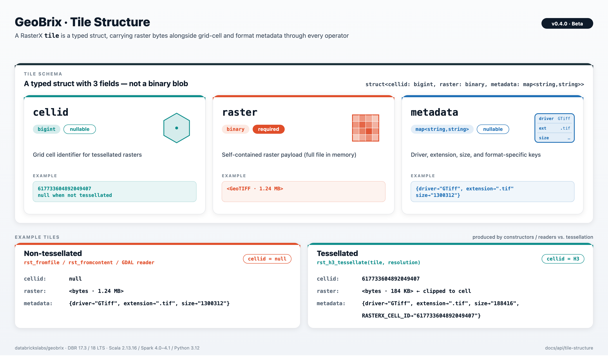

import CodeFromTest from '@site/src/components/CodeFromTest';
import tileStructureExamples from '!!raw-loader!../../tests/python/api/tile_structure.py';
import tileStructureScala from '!!raw-loader!../../tests/scala/api/TileStructureExamples.scala';

# Tile Structure

Understanding the internal structure of GeoBrix tiles is essential for advanced use cases like custom UDFs, direct data manipulation, and performance optimization.

## Overview

In GeoBrix, a **tile** is not a simple binary column—it's a **structured type** (struct) containing three fields that together represent a raster dataset along with its metadata and optional grid cell information.

## Tile Schema

A tile has the following structure:



```
struct<
  cellid: bigint,                 -- Grid cell ID (nullable)
  raster: binary,                 -- Raster bytes
  metadata: map<string,string>    -- Driver, extension, size, etc.
>
```

### Field Descriptions

| Field | Type | Nullable | Description |
|-------|------|----------|-------------|
| `cellid` | `bigint` (Long) | Yes | Grid cell identifier for tessellated rasters. `null` for non-tessellated rasters. |
| `raster` | `binary` | No | Binary raster content (bytes). |
| `metadata` | `map<string,string>` | Yes | Key-value map containing driver name, file extension, size, and other metadata. |

---

## Field Details

### 1. cellid

The `cellid` field identifies which grid cell a tile belongs to when using tessellation (e.g., `rst_h3_tessellate`).

**Properties:**
- **Type**: `bigint` (64-bit integer)
- **Nullable**: Yes
- **Purpose**: Enables spatial indexing and joining of tessellated rasters

**Values:**
- `null` - For non-tessellated rasters (e.g., from `rst_fromfile`)
- `> 0` - For tessellated rasters (H3 cell ID)

**Example:**

<CodeFromTest code={tileStructureExamples} functionName="SQL_CELLID_NON_TESSELLATED" language="sql" source="docs/tests/python/api/tile_structure.py" testFile="docs/tests/python/api/test_tile_structure.py" outputConstant="SQL_CELLID_NON_TESSELLATED_output" />

<CodeFromTest code={tileStructureExamples} functionName="SQL_CELLID_TESSELLATED" language="sql" source="docs/tests/python/api/tile_structure.py" testFile="docs/tests/python/api/test_tile_structure.py" outputConstant="SQL_CELLID_TESSELLATED_output" />

### 2. raster

The `raster` field contains the actual raster bytes — the full file content in memory.

**All tile constructors and readers produce binary content:**
- `rst_fromfile(path, driver)` → reads the file at `path` into **binary** bytes
- `rst_fromcontent(content, driver)` → embeds the given **binary** bytes
- GDAL reader → **binary** (raster bytes)

**Properties:**
- **Type**: `binary`
- **Nullable**: No
- **Purpose**: Self-contained raster payload carried through the plan; downstream operators
  (`rst_clip`, `rst_transform`, ...) read and produce bytes, so there is no orphan-path risk.

**Binary Format:**
- Complete raster file (e.g. GeoTIFF) in memory
- Can be deserialized with GDAL/rasterio
- Typically compressed (LZW, DEFLATE, etc.)

**Example:**

<CodeFromTest code={tileStructureExamples} functionName="access_path_and_binary" language="python" source="docs/tests/python/api/tile_structure.py" testFile="docs/tests/python/api/test_tile_structure.py" outputConstant="access_path_and_binary_output" />

### 3. metadata

The `metadata` field contains key-value pairs describing the raster format and properties.

**Properties:**
- **Type**: `map<string,string>`
- **Nullable**: Yes
- **Purpose**: Provides format information needed for GDAL operations

**Common Keys:**
- `driver` - GDAL driver name (e.g., "GTiff", "NetCDF", "HDF4")
- `extension` - File extension (e.g., ".tif", ".nc")
- `size` - Size in bytes (as string) matching the length of the raster payload
- Other format-specific metadata

**Example:**

<CodeFromTest code={tileStructureExamples} functionName="access_metadata_fields" language="python" source="docs/tests/python/api/tile_structure.py" testFile="docs/tests/python/api/test_tile_structure.py" outputConstant="access_metadata_fields_output" />

---

## Working with Tiles

### Accessing Tile Fields

Use dot notation to access tile struct fields:

**Python:**

<CodeFromTest code={tileStructureExamples} functionName="accessing_tile_fields_python" language="python" source="docs/tests/python/api/tile_structure.py" testFile="docs/tests/python/api/test_tile_structure.py" outputConstant="accessing_tile_fields_python_output" />

**Scala:**

<CodeFromTest
  code={tileStructureScala}
  language="scala"
  source="docs/tests/scala/api/TileStructureExamples.scala"
  testFile="docs/tests/scala/api/TileStructureExamplesDocTest.scala"
  functionName="ACCESSING_TILE_FIELDS_SCALA"
  outputConstant="ACCESSING_TILE_FIELDS_SCALA_output"
/>

**SQL:**

<CodeFromTest code={tileStructureExamples} functionName="SQL_ACCESSING_TILE_FIELDS" language="sql" source="docs/tests/python/api/tile_structure.py" testFile="docs/tests/python/api/test_tile_structure.py" outputConstant="SQL_ACCESSING_TILE_FIELDS_output" />

### Filtering by Metadata

Filter tiles based on driver or other metadata:

<CodeFromTest code={tileStructureExamples} functionName="filtering_by_metadata" language="python" source="docs/tests/python/api/tile_structure.py" testFile="docs/tests/python/api/test_tile_structure.py" outputConstant="filtering_by_metadata_output" />

### Using Tiles in Custom UDFs

Access tile components for custom processing:

<CodeFromTest code={tileStructureExamples} functionName="using_tiles_in_custom_udfs" language="python" source="docs/tests/python/api/tile_structure.py" testFile="docs/tests/python/api/test_tile_structure.py" outputConstant="using_tiles_in_custom_udfs_output" />

### Processing Binary Raster Data

When the `raster` field contains binary data, use it with rasterio or GDAL:

<CodeFromTest code={tileStructureExamples} functionName="processing_binary_raster_data" language="python" source="docs/tests/python/api/tile_structure.py" testFile="docs/tests/python/api/test_tile_structure.py" outputConstant="processing_binary_raster_data_output" />

### Comparing `rst_fromfile` vs `rst_fromcontent`

Both produce tiles whose `raster` field is binary. Use `rst_fromfile` when you have a path,
and `rst_fromcontent` when you already have bytes (e.g. from `spark.read.format("binaryFile")`).

<CodeFromTest code={tileStructureExamples} functionName="comparing_fromfile_vs_fromcontent_tiles" language="python" source="docs/tests/python/api/tile_structure.py" testFile="docs/tests/python/api/test_tile_structure.py" outputConstant="comparing_fromfile_vs_fromcontent_tiles_output" />

---

## Tessellated vs Non-Tessellated Tiles

### Non-Tessellated Tiles

Created by constructors (`rst_fromfile`, `rst_fromcontent`) or readers:

<CodeFromTest code={tileStructureExamples} functionName="non_tessellated_tiles" language="python" source="docs/tests/python/api/tile_structure.py" testFile="docs/tests/python/api/test_tile_structure.py" outputConstant="non_tessellated_tiles_output" />

**Characteristics:**
- `cellid` is `null`
- Represents entire raster or a tile from tiling operations
- Suitable for processing complete rasters

### Tessellated Tiles

Created by `rst_h3_tessellate`:

<CodeFromTest code={tileStructureExamples} functionName="tessellated_tiles" language="python" source="docs/tests/python/api/tile_structure.py" testFile="docs/tests/python/api/test_tile_structure.py" outputConstant="tessellated_tiles_output" />

**Characteristics:**
- `cellid` contains H3 cell ID
- Raster clipped to cell bounds
- Enables spatial joins and grid-based processing
- Metadata includes `RASTERX_CELL_ID` key

---

## Next Steps

- [Raster Functions](./raster-functions) - Functions that work with tiles
- [Custom UDFs](../advanced/custom-udfs) - Build custom tile processing
- [Library Integration](../advanced/library-integration) - Use tiles with rasterio/xarray
