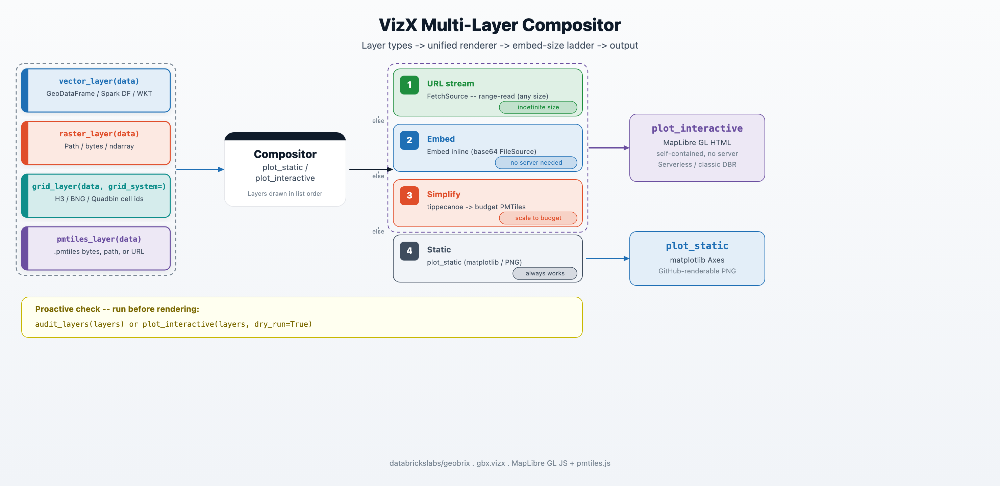

import CodeFromTest from '@site/src/components/CodeFromTest';
import vizxLayers from '!!raw-loader!../../tests/python/api/vizx_layers.py';

# Multi-Layer Compositor

A single GeoBrix analysis often produces several result layers at once — vector zone boundaries, a raster DEM, discrete H3 grid cells, and a pre-tiled PMTiles archive. `plot_static` and `plot_interactive` accept a **list of layers** and composite them in order, so one function call produces one map.

When the total GeoJSON + PNG payload fits within the 64 MB default embed budget, `plot_interactive` embeds everything inline in the HTML string — no tile server, no separate request. When it doesn't fit, the embed-size ladder picks the right path automatically. The runnable example below composites two vector layers; raster- and grid-layer usage is shown in the [Vector](./vizx-vector) and [Raster](./vizx-raster) references.

:::note Opt-in extra
The compositor requires `geobrix[vizx]`. Install with:
```bash
pip install "geobrix[vizx]"
```
:::

## Layer types

Each constructor returns a `Layer` object. Pass a list of them to `plot_static` or `plot_interactive`.

| Constructor | Typical input | Notes |
|---|---|---|
| `vector_layer(data)` | `geopandas.GeoDataFrame`, Spark DataFrame, WKT/WKB | Accepts any geometry encoding. |
| `raster_layer(data)` | COG/raster file path, `numpy.ndarray`, or tile struct | Path → rasterio; ndarray → unit-square corners. |
| `grid_layer(data, grid_system=)` | DataFrame of H3 / BNG / Quadbin cell ids | Requires `grid_system='h3'`, `'bng'`, `'quadbin'`, or `'custom'`. |
| `pmtiles_layer(data)` | `.pmtiles` bytes, local path, or `https://` URL | URL mode streams from the remote server with zero embed cost. |

```python
from databricks.labs.gbx.vizx import (
    vector_layer,
    raster_layer,
    grid_layer,
    pmtiles_layer,
    plot_static,
    plot_interactive,
)
```

Each constructor exposes a `label=` argument used in audit output and map legends.

## The embed-size ladder

When total payload grows beyond the 64 MB default, `plot_interactive` walks through a four-rung ladder to find the right delivery strategy:



| Rung | Condition | Delivery |
|---|---|---|
| **1 — URL** | `pmtiles_layer` carries an `https://` URL | `FetchSource` range-reads on demand; zero embed cost. |
| **2 — embed** | Total HTML size ≤ `max_embed_mb` (default 64 MB) | Base64 `FileSource` in-browser; no server, no network at render time. |
| **3 — simplify** | Over budget, `simplify_tiles_spec=` provided | Runs `tippecanoe` to produce a budget-sized PMTiles archive, then re-embeds. |
| **4 — static** | Over budget, no simplify path | Falls back to `plot_static`; GitHub-renderable PNG. |

The `max_embed_mb` threshold applies to the assembled HTML byte length, not to individual layer sizes.

## Multi-layer static composite

`plot_static` draws each layer in order on a single `matplotlib.Axes` and returns it. Layers are reprojected to Web Mercator (EPSG:3857) so they align with one another and with any basemap. Pass `basemap=False` for a deterministic, offline-safe render.

<CodeFromTest
  code={vizxLayers}
  language="python"
  title="Composite two vector layers (no basemap)"
  source="docs/tests/python/api/vizx_layers.py"
  testFile="docs/tests/python/api/test_vizx_layers.py"
  functionName="multilayer_static_example"
/>

The static path renders every listed layer type except `pmtiles_layer` (which emits a warning and produces no output — use `plot_interactive` for PMTiles, or let the budget ladder decode them automatically on the fallback path).

## Multi-layer interactive map

`plot_interactive` converts each layer to MapLibre GL sources, assembles one self-contained HTML string, and either embeds it inline or streams it from a URL depending on the embed-size ladder above. Use `dry_run=True` to inspect the size audit without rendering.

<CodeFromTest
  code={vizxLayers}
  language="python"
  title="Multi-layer interactive map — dry_run audit"
  source="docs/tests/python/api/vizx_layers.py"
  testFile="docs/tests/python/api/test_vizx_layers.py"
  functionName="multilayer_interactive_example"
/>

In a Databricks notebook, omit `dry_run=True` and `plot_interactive` calls `displayHTML` automatically. Outside a notebook (plain Python, tests), it returns the HTML string.

## Proactive audit: never a surprise

Call `audit_layers` before rendering to see exactly how much budget each layer consumes and which rung the compositor will select.

<CodeFromTest
  code={vizxLayers}
  language="python"
  title="Proactive embed-size audit"
  source="docs/tests/python/api/vizx_layers.py"
  testFile="docs/tests/python/api/test_vizx_layers.py"
  functionName="audit_layers_example"
/>

The returned dict has the following keys:

| Key | Type | Description |
|---|---|---|
| `fits` | `bool` | True when total HTML size is within the budget. |
| `verdict` | `str` | `"embed"`, `"url"`, `"simplify"`, or `"static"`. |
| `total_embed_bytes` | `int` | Actual assembled-HTML byte length. |
| `max_embed_bytes` | `int` | Budget in bytes (`max_embed_mb * 1_048_576`). |
| `layers` | `list[dict]` | Per-layer breakdown: `label`, `kind`, `embed_bytes`, `max_tile_bytes`. |

`plot_interactive(layers, dry_run=True)` is an equivalent one-liner that also prints the audit line without rendering.

## Ephemeral vs durable simplification

When the embed budget is tight, `simplify_tiles_from_source` lets you pre-tile data into a compact PMTiles archive with `tippecanoe`. The result can be held in memory (ephemeral) or written to a path (durable).

**Ephemeral** — bytes returned directly, held in driver memory:

<CodeFromTest
  code={vizxLayers}
  language="python"
  title="Ephemeral simplification (in-memory bytes)"
  source="docs/tests/python/api/vizx_layers.py"
  testFile="docs/tests/python/api/test_vizx_layers.py"
  functionName="simplify_ephemeral_example"
/>

**Durable** — written to a file path, reusable across sessions:

<CodeFromTest
  code={vizxLayers}
  language="python"
  title="Durable simplification (written to path)"
  source="docs/tests/python/api/vizx_layers.py"
  testFile="docs/tests/python/api/test_vizx_layers.py"
  functionName="simplify_durable_example"
/>

If you already have a PMTiles archive and only need an overview embed (for example, cutting a detailed 0–14 archive down so it fits an interactive cell), you don't need to re-tile from source. Pass the archive to `plot_pmtiles(archive, interactive_fit="downzoom")` — the interactive embedder drops the highest (densest) zoom levels until the rendered archive fits the embed budget. This reduction is binary-free (no `tippecanoe`) and works for both raster and vector tiles, since it rebuilds a smaller archive from the tiles already present.

:::note Requires tippecanoe
`simplify_tiles_from_source` requires the `tippecanoe` binary (the `interactive_fit="downzoom"` archive reduction above does not).

`pip install "geobrix[vizx]"` installs the `tippecanoe` Python wheel (manylinux), so **Databricks clusters and Serverless are covered automatically** — no extra step needed.

On **macOS** (especially Apple Silicon) the manylinux wheel may be unavailable or unreliable; use `brew install tippecanoe` as a fallback. The rest of VizX (plotting, compositing, audit) works without tippecanoe.
:::

Once you have a durable archive, pass it to `pmtiles_layer` and embed it or stream it from a Volume URL:

```python
from databricks.labs.gbx.vizx import pmtiles_layer, plot_interactive

# Embed a pre-tiled overview archive
layers = [pmtiles_layer("overview.pmtiles", label="overview")]
plot_interactive(layers)

# Stream from a Volume URL (zero embed cost, any size)
layers = [pmtiles_layer(
    "https://<workspace>.azuredatabricks.net/api/2.0/fs/files/Volumes/.../overview.pmtiles",
    label="overview",
)]
plot_interactive(layers)
```

## Scale guidance

The 64 MB default embed budget covers most notebook use cases — a few hundred thousand polygon vertices typically lands well under it. When your data is larger:

1. **Pre-tile with `simplify_tiles_from_source`** to generate a compact overview archive, then embed or stream it.
2. **Stage the archive on a Volumes URL** and use `pmtiles_layer("https://...")` — URL mode has zero embed cost regardless of archive size.
3. For very large datasets requiring distributed tile generation, the [Helios notebooks](../notebooks/helios) show how to produce multi-shard PMTiles archives with `gbx_pmtiles_agg` and serve them directly.

**Dynamic zoom cut-over (live kernel).** `plot_interactive_dynamic(layers, simplify_tiles_spec=…)` embeds a low-zoom overview of the archive inline and streams higher-zoom detail on pan/zoom (with optional neighbour prefetch). This avoids serving the full archive at once, so it stretches the usable embed budget further. It requires a **live kernel** — it is an ipywidget and does not render in a committed `.ipynb` on GitHub or in the docs site; the static composite covers that surface.

**Beyond the embed budget — Databricks App tile server.** When a single archive is too large even for the dynamic cut-over, or when you need indefinite interactivity for end users outside a notebook, the long-term path is a **Databricks App** that acts as a tile server backed by your PMTiles archive on Volumes. This is a planned capability; for now, URL-mode streaming (`pmtiles_layer("https://...")`) and multi-shard archives via `gbx_pmtiles_agg` cover most production cases.

The static fallback (`plot_static`) is always available as a last resort. It produces a GitHub-renderable PNG that bakes the basemap in at execution time via `contextily` — no network needed at render time, and the output displays correctly on GitHub and in docs.

## Next steps

- [VizX Function Reference](./vizx) — raster plotters, vector adapters, `plot_cog`
- [PMTiles functions](./pmtiles-functions) — building and inspecting PMTiles archives
- [Helios notebooks](../notebooks/helios) — end-to-end: vector + raster + PMTiles in one notebook
