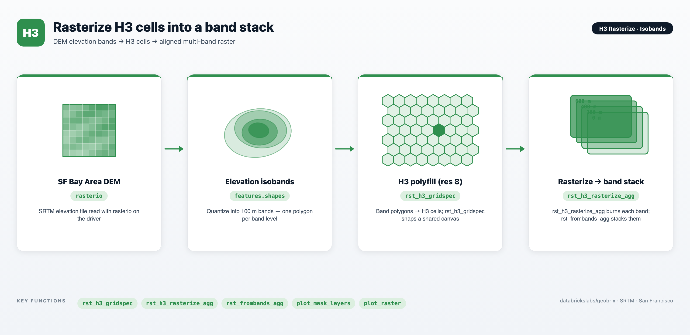

# H3 Rasterize — Polygon Isobands to Multi-Band H3 Raster Stack

An end-to-end example showing how to convert arbitrary polygon isobands — elevation contours, signal-strength coverage zones, or any threshold-derived footprint — into a pixel-aligned, multi-band H3 raster stack using GeoBrix RasterX and the lightweight `gbx.vizx` helpers.

The notebook works through the San Francisco Bay Area: it reads a 1°×1° SRTM DEM tile (`srtm_n37w123.tif`, EPSG:4326) covering the SF Peninsula, Marin headlands, and East Bay hills, extracts eight 100 m elevation bands (0–700 m), polyfills each band with H3 resolution-8 hexagons, computes a shared pixel grid that spans all bands with `rst_h3_gridspec`, burns each band onto that grid with `rst_h3_rasterize_agg`, and assembles all eight single-band tiles into one multi-band GeoTIFF with `rst_frombands_agg`. A coverage-depth composite rendered by `plot_raster` closes the loop, showing at a glance how many elevation bands cover each pixel.



:::tip View on GitHub
**[notebooks/examples/h3-rasterize](https://github.com/databrickslabs/geobrix/tree/main/notebooks/examples/h3-rasterize)** — download `h3_rasterize_isobands.ipynb` and import it into your Databricks workspace to run.
:::

:::info Runs on the lightweight tier (`geobrix[light,vizx]`)
The notebook uses the **lightweight tier** — pure Python/PySpark bindings (`databricks.labs.gbx.pyrx`) plus the `geobrix[light,vizx]` wheel — so it runs on **Serverless** with no JAR or GDAL init script. The per-band rasterize result is materialized into a **session-scoped temporary table** (`CREATE TEMP TABLE`) so that the stacking step reads cached bytes instead of recomputing the burn. Session temp tables require **Serverless or DBR 18.1+**; they are not supported on dedicated / single-user clusters. See [Execution Tiers](https://databrickslabs.github.io/geobrix/docs/api/execution-tiers) for the trade-offs between lightweight and heavyweight.
:::

---

## Files

| File | Purpose |
|---|---|
| `h3_rasterize_isobands.ipynb` | The full pipeline: DEM staging, isoband extraction, H3 polyfill, shared grid spec, per-band rasterize, band stacking, and visualization. |
| `README.md` | Setup instructions, requirements, and a summary of each pipeline step. |

---

## Prerequisites

- **Databricks Runtime 17.3 LTS / 18.1+ or Serverless** (Spark 4 / Python 3.12). Lightweight default runs on Serverless. Session temp tables (Step 4) require Serverless or DBR 18.1+; they are not available on dedicated / single-user clusters.
- **GeoBrix** (version 0.4.0). The `%pip install` cell installs the `geobrix[light,vizx]` wheel, which pulls in `rasterio` (used for the driver-side DEM read and isoband extraction), `h3` (polyfill), `matplotlib`, `geopandas`, `folium`, and `mapclassify` (visualization). No JAR or GDAL init script is required.
- **Unity Catalog Volume**: the DEM is staged to `/Volumes/geospatial_docs/geobrix/sample-data/geobrix-examples/sf/elevation/srtm_n37w123.tif`. Update `DEM_PATH` if your Volume layout differs. The Volume root must already exist; the staging cell creates sub-directories but not the root.
- **Wheel path**: update the `%pip install` cell to point at your staged `geobrix-0.4.0-py3-none-any.whl` if its Volume path differs from the default.

---

## Run order

1. **Install and restart** — the `%pip install` cell installs `geobrix[light,vizx]` and is followed immediately by `%restart_python`; run cells in order without skipping the restart.
2. **Imports and registration** — imports `pyrx`, `gbx.vizx` helpers, and calls `rx.register(spark)` + `register(spark)` to install SQL UDFs.
3. **Stage the DEM** — the staging cell downloads `srtm_n37w123.tif` from public AWS Terrain Tiles to the Volume (idempotent; skipped if the file already exists).
4. **Steps 1–2 (driver)** — DEM read, isoband extraction, and H3 polyfill all run on the driver via `rasterio` and `h3`. A Spark DataFrame is created from the resulting `(band_level, cellid)` rows.
5. **Steps 3–5 (Spark)** — `rst_h3_gridspec` (shared canvas), `rst_h3_rasterize_agg` (per-band burn → materialized temp table), and `rst_frombands_agg` (multi-band stack) fan out across executors.

---

## Data flow

```text
srtm_n37w123.tif  (SRTM, EPSG:4326, AWS Terrain Tiles → UC Volume)
        │
        ▼  rasterio + rasterio.features.shapes (driver)
Elevation isobands  (8 GeoJSON polygon groups, 0–700 m, 100 m step)
        │
        ▼  h3.polygon_to_cells @ resolution 8 (driver)
(band_level, cellid) DataFrame  (~12 000 rows after dedup)
        │
        ▼  rx.rst_h3_gridspec (Spark)
Shared grid spec  (xmin/ymin/xmax/ymax/width/height, single canvas for all bands)
        │
        ▼  rx.rst_h3_rasterize_agg grouped by band_level (Spark) → TEMP TABLE
Per-band presence tiles  (8 × 499×505 px, 1-band each, NoData = not covered)
        │
        ▼  rx.rst_frombands_agg ordered by band_level (Spark)
Multi-band GeoTIFF stack  (1 tile, 8 bands, 499×505 px, EPSG:4326)
        │
        ▼  plot_raster(composite="depth") + plot_mask_layers / cells_as_gdf / grid_as_gdf
Coverage-depth composite + per-band footprint overlays
```

---

## Key GeoBrix / Databricks functions shown

- **`rst_h3_gridspec`** — computes a pixel-snapped bounding box and pixel dimensions spanning all H3 cells across all band levels; used without a grouping column here to produce a single shared canvas. See [H3 Grid](../api/raster-functions#h3-grid).
- **`rst_h3_rasterize_agg`** — aggregator that burns a group's H3 cells onto the shared canvas (supplied explicitly via `xmin`/`ymin`/`xmax`/`ymax`/`width`/`height` columns), producing a single-band presence mask per band level. See [H3 Grid](../api/raster-functions#h3-grid).
- **`rst_frombands_agg`** — aggregator that assembles per-band single-band tiles into one multi-band GeoTIFF, ordered by a user-supplied `band_index` column.
- **`gbx.vizx` helpers** ([Visualization API](../api/vizx)):
  - `plot_mask_layers` — overlays two or more named binary masks on a single figure, each in a distinct colour with a legend, for side-by-side band coverage comparison.
  - `plot_raster(composite="depth")` — renders the stacked tile as a coverage-depth heatmap: per-pixel count of bands that cover that location, transparent where no band covers.
  - `grid_as_gdf` — converts the `grid` struct from `rst_h3_gridspec` into a single-row GeoDataFrame for folium overlay.
  - `cells_as_gdf` — converts a `(cellid, ...)` DataFrame into a GeoDataFrame (one hexagon polygon per row) for matplotlib or folium visualization.

---

## Gotchas

- **Session temp table requires Serverless or DBR 18.1+**: the notebook materializes per-band tiles with `CREATE OR REPLACE TEMP TABLE` (via a temp view bridge) to avoid recomputing the burn in the stacking step. On Serverless `.cache()` / `.persist()` are unavailable; a session temp table is the idiomatic alternative. This syntax is not supported on dedicated or single-user clusters — if you must run there, remove the temp-table step and pass `bands_df` directly into `rst_frombands_agg` (at the cost of recomputing the rasterize).
- **Driver-side DEM steps are intentional**: isoband extraction and H3 polyfill run on the driver because the notebook reads a single DEM tile. For a production pipeline that ingests many tiles, load the DEM files into a Spark DataFrame via `spark.read.format("binaryFile")` or the `gtiff_gbx` reader (one row per file) and move both steps into a pandas UDF or UDTF so they fan out per tile across executors.
- **Shared canvas is required for stacking**: all per-band tiles passed to `rst_frombands_agg` must have identical pixel dimensions (width × height) and spatial extent. Broadcasting the `xmin`/`ymin`/`xmax`/`ymax`/`width`/`height` literals from `rst_h3_gridspec` to every row before grouping ensures this. Mismatched extents produce a corrupt or truncated stack.
- **Cell-ID encoding**: `h3.polygon_to_cells` returns string hex IDs; the notebook converts them to 64-bit integers via `h3.str_to_int` because PySpark maps `LongType` to Scala `Long`. Pass integer cell IDs to `rst_h3_rasterize_agg`; string IDs will fail at runtime.
- **Coordinate ordering for `h3.LatLngPoly`**: `rasterio.features.shapes` returns GeoJSON `(lon, lat)` tuples; `h3.LatLngPoly` expects `(lat, lon)`. The notebook swaps the pair explicitly in the polyfill loop — omitting this swap shifts the polyfill to the wrong hemisphere.
- **Volume write is sequential (FUSE-safe)**: the DEM staging cell copies the converted GeoTIFF to the Volume via `shutil.copy` from a node-local temp directory. This is the correct pattern for Unity Catalog Volume writes on Serverless: avoid `seek`, use sequential I/O, and never write directly into `/tmp` paths that are not node-local scratch.
