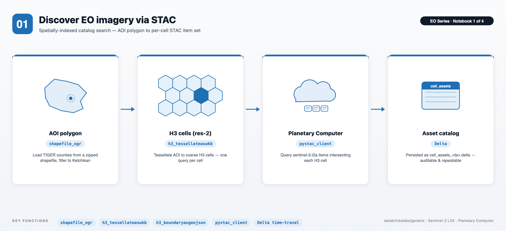
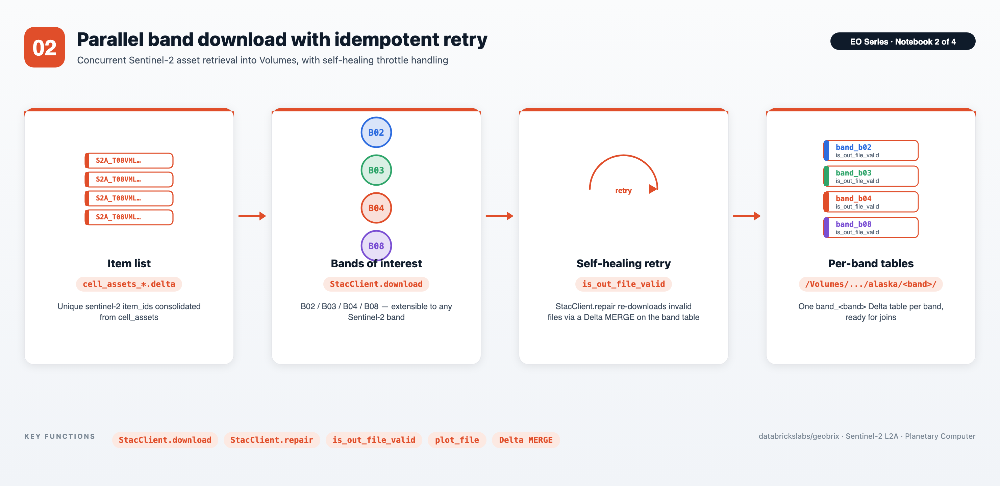
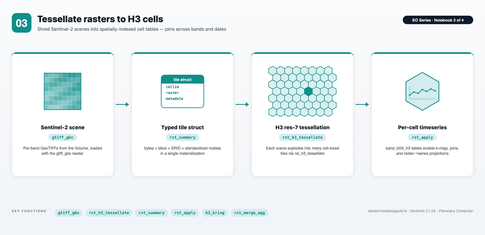
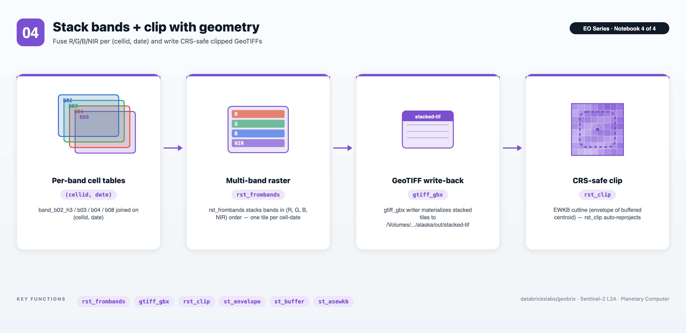

# EO Series — End-to-End STAC to Gridded Rasters with GeoBrix

An end-to-end Earth Observation (EO) example series built on [GeoBrix](https://databrickslabs.github.io/geobrix/)'s RasterX functions, Databricks built-in Spatial SQL functions, and Microsoft [Planetary Computer](https://planetarycomputer.microsoft.com/) as the [STAC](https://stacspec.org/en) source.

The four main notebooks move from vector area-of-interest → STAC discovery → band download → gridded (H3) raster tables → multi-band stacking and clipping. Sentinel-2 L2A over Alaska is used as the working dataset (scoped to a single county — Ketchikan, `GEOID=2130` — to fit Planetary Computer free-tier limits).

> __Lightweight tier (Serverless) by default.__ The series uses the lightweight tier — pure Python/PySpark bindings (`databricks.labs.gbx.pyrx`) plus the `geobrix[light,stac,viz]` wheel, installed by `config_nb` — so it runs on Serverless with no JAR. STAC search and download are handled by `StacClient` from `databricks.labs.gbx.stac` (see [STAC Client](https://databrickslabs.github.io/geobrix/docs/api/stac)); visualization helpers come from `databricks.labs.gbx.viz`. To run heavyweight instead, flip the commented *option-2* (`rasterx`) in `config_nb.ipynb` and attach the GeoBrix JAR + [GDAL init script](https://databrickslabs.github.io/geobrix/docs/installation) to a classic x86 cluster. Spark-conf tuning goes through a `set_conf_safe()` helper that no-ops on Serverless. See [Execution Tiers](https://databrickslabs.github.io/geobrix/docs/api/execution-tiers).

> __Note:__ Downloads are throttled on the Planetary Computer free tier. `StacClient.download` validates each file with a rasterio read and publishes to the Volume only when the file passes. Call `stac_client.repair("band_b02")` to re-download any files that failed validation. Set `FORCE_REBUILD = True` (after `%run ./config_nb`) to force a full rebuild via the existing `do_overwrite` / skip-guards.

---

## Notebooks at a glance

### 01 — Discover EO imagery via STAC



- **Spatially-indexed STAC search** — tessellate any AOI polygon to H3 res-2 cells and query Planetary Computer per cell, so results are pre-keyed to the grid you'll join on later.
- **Shapefile I/O without unzipping** — the `shapefile_gbx` reader pulls TIGER counties straight from a `.zip` blob in the Volume; no scratch-disk shuffling required.
- **Persisted, time-travel-friendly catalog** — every search lands in a timestamped `cell_assets_<ts>.delta` directory, giving an auditable handoff into notebook 02.

### 02 — Parallel band download with idempotent retry



- **Spark-driven concurrent download** — a `pandas_udf` (`download_band`) fans out per-(item, band) HTTPS retrievals across the cluster, writing files into a Volume and one Delta table per band.
- **Idempotent and self-healing** — a 1 KB validity threshold detects throttled auth-error payloads, and a Delta MERGE retry path (`update_assets` / `download_missing_assets`) repairs corrupt files without re-downloading the whole catalog.
- **Cleanly bounded scope** — only the bands you ask for (B02 / B03 / B04 / B08 by default) are pulled; the same flow extends to any other Sentinel-2 band.

### 03 — Tessellate rasters to H3 cells



- **One-step raster ingestion** — the `gtiff` reader (and the `binaryFile` → `rst_fromcontent` pattern) materializes a typed `tile` column with bytes, bbox, SRID, and standardized nodata in a single pass.
- **Spatial-indexed raster tables** — `rst_h3_tessellate` shreds each Sentinel-2 scene into H3 resolution-7 cells, producing `band_b0X_h3` Delta tables that join cleanly across bands and dates.
- **Raster analytics from SQL/PySpark** — `rst_summary` for per-tile stats, `h3_kring` + `rst_merge_agg` for spatial neighborhoods, and the `rst_apply` escape-hatch for raster-to-timeseries projection — no driver-side rasterio loops.

### 04 — Band Stacking + Clipping



- **Multi-band assembly from grid joins** — joins `band_b02_h3` / `b03` / `b04` / `b08` on `(cellid, date)`, then `rst_frombands` produces a single 4-band (R, G, B, NIR) tile per cell-date.
- **Round-trip GeoTIFF writes** — the `gtiff` writer (`nameCol`, `mode("append")`, `option("ext", "tif")`) materializes the stacked rasters back to disk in a Volume, ready for downstream tools.
- **CRS-safe geometry clipping** — clip cutlines built from `st_envelope` / `st_buffer` are passed as **EWKB** with embedded SRID, and `rst_clip` reprojects automatically — no per-tile CRS bookkeeping.

---

## Files

| File | Purpose |
|---|---|
| `config_nb.ipynb` | Shared setup (`%run ./config_nb` from every main notebook). Installs the `geobrix[light,stac,viz]` wheel + EO deps, selects the tier (option-1 `pyrx` default / option-2 `rasterx`), registers functions + light readers/writers, imports the visualization helpers from `databricks.labs.gbx.viz` (`plot_raster`, `plot_file`, `as_gdf`, `cells_as_gdf`) and the pyrx escape-hatches (`rst_apply`, `tile_to_numpy`), sets Unity Catalog `catalog_name` / `schema_name`, creates the `/Volumes/<cat>/<schema>/data/alaska` ETL tree, exposes the `FORCE_REBUILD` toggle and the Serverless-safe `set_conf_safe()` helper, instantiates `stac_client = StacClient()`, and defines tiling helpers (`finalize_tiled_band_tbl`, `gen_tessellate_tiled_band`). |
| `01. Search STACs.ipynb` | Loads the TIGER US Counties shapefile via the `shapefile_gbx` reader, filters to Ketchikan, tessellates into H3 resolution-2 cells, converts each cell to GeoJSON, and calls `stac_client.search(df_cells, geojson_col="geojson", collections=["sentinel-2-l2a"], ...)` to fan out per-cell queries to Planetary Computer. Writes the resulting STAC asset metadata — one row per `(cell, item, asset)` — to a timestamped Delta directory (`cell_assets_<ts>.delta`). |
| `02. Download STACs.ipynb` | Reads `cell_assets_*.delta` and calls `stac_client.download(band_rows, out_dir, asset_names=[band], ...)` for each band. Creates one `band_<band>` Delta table per band with `item_id`, `band_name`, `date`, `out_file_path`, `out_file_sz`, and `is_out_file_valid` columns. Calls `stac_client.repair("band_<band>")` to re-download and merge any files that failed read-validation. |
| `03. Gridded EO Data.ipynb` | For each band, joins the Delta band table with the `gtiff` reader, materializes `band_<band>_tile` (adds `size`, `bbox`, `srid`, and standardized nodata), then tessellates each tile to H3 resolution 7 into `band_<band>_h3`. Demonstrates `rst_summary`, bounding-box reprojection, `h3_kring` with `rst_merge_agg`, and raster → timeseries projection via the `rst_apply` escape-hatch. |
| `04. Band Stacking + Clipping.ipynb` | Joins the four `band_<band>_h3` tables on `(cellid, date)`, stacks bands in (R, G, B, NIR) order with `rst_frombands` into the `band_stack` table, writes multi-band TIFs back out via the `gtiff` writer (`nameCol`-driven filenames), and demonstrates per-tile clipping with `rst_clip` using a centroid-envelope buffer built from Databricks built-in ST functions. |

---

## Prerequisites

- **Databricks Runtime 17.3 LTS / 18 LTS, or Serverless** (Scala 2.13 / Spark 4 / Python 3.12). The lightweight default runs on Serverless; the heavyweight tweak needs a classic x86 cluster.
- **GeoBrix** (version 0.4.0). `config_nb.ipynb` `%pip`-installs the `geobrix[light,stac,viz]` wheel — pure-Python bindings + rasterio + the STAC client dependencies (`pystac-client`, `planetary-computer`, `tenacity`, `requests`) + the visualization extras (`matplotlib`, `geopandas`, `folium`, `mapclassify`) — nothing is assumed pre-staged. For the heavyweight tweak, flip option-2 (`rasterx`) in `config_nb.ipynb` and attach the GeoBrix JAR + GDAL init script to the cluster.
- **Unity Catalog**: edit `config_nb.ipynb` to set `catalog_name` and `schema_name` to your own locations. A Volume named `data` must already exist under `<catalog>/<schema>`. The notebooks create a schema if missing but will not create the Volume for you.
- **Compute sizing**: the lightweight default runs on Serverless. On classic clusters, the captured heavyweight runs used AWS `m5d.xlarge` (2–16 workers) for search/download and `r6id.2xlarge` (20 workers) for raster processing; an `x86` instance is required for the GDAL natives. For a single county a much smaller cluster is sufficient.

---

## Run order

1. Open `config_nb.ipynb`, set `catalog_name` / `schema_name`, and verify the Volume exists.
2. Run notebooks in numeric order: **01 → 02 → 03 → 04**. Each notebook starts with `%run ./config_nb` so the shared state is re-established every time.

Each notebook is safe to re-run — Delta tables use `do_overwrite=False` / `do_append=False` by default, and `StacClient.download` skips assets whose files already exist and passed read-validation. To force a full rebuild of a notebook's outputs, set `FORCE_REBUILD = True` in a cell right after `%run ./config_nb`; it feeds the existing `do_overwrite` / skip-guards.

---

## Data flow

```
TIGER shapefile (shapefile_gbx reader)
        │
        ▼  Ketchikan polygon → H3 res-2 cells → GeoJSON
STAC search (Planetary Computer, sentinel-2-l2a)
        │
        ▼  cell_assets_<ts>.delta      (nb 01)
Per-band asset download
        │
        ▼  band_b02, band_b03, band_b04, band_b08  (nb 02)
gtiff read + tile metadata
        │
        ▼  band_b0X_tile                (nb 03)
H3 tessellation @ resolution 7
        │
        ▼  band_b0X_h3                  (nb 03)
Join on (cellid, date) + rst_frombands
        │
        ▼  band_stack                   (nb 04)
gtiff writer → stacked TIFs + rst_clip
        │
        ▼  /Volumes/.../alaska/out/stacked-tif
```

---

## Serverless execution strategy

This series defaults to the lightweight tier so it runs on **Serverless** — set the notebook **Environment to version 5+** (Python 3.12) so the `[light]` dependencies resolve. Serverless changes a few habits vs. a classic cluster, and the notebooks lean on these patterns on purpose:

- **No runtime `spark.conf` tuning.** Serverless disallows `spark.conf.set(...)`, so the old "raise `spark.sql.shuffle.partitions`" trick is a no-op (the `set_conf_safe(...)` helper swallows it). To control parallelism we call **`DataFrame.repartition(N, col)`** instead — a number-only `repartition(N)` (round-robin) **is** AQE-coalesced back toward ~1 partition on small data (= serial), but a **hash repartition by a column** is respected. So the explicit `repartition(N, key)` before each expensive UDF (downloads, tiling, tessellation) is deliberate, not redundant.
- **No `.cache()` / `persist()`.** Not available on Serverless; where we'd cache, we **write to a managed table** instead (also the production-friendly choice) and read it back.
- **~1 GB per-UDF (Arrow) memory cap.** Each Python/pandas UDF task is capped near 1 GB. Two levers keep tasks under it: (1) **read less** — the `bbox` pushdown on the shapefile reader parses only the AOI, and the `gtiff` reader's `sizeInMB` splits big scenes into sub-tiles; and (2) **one item/tile per task** via `repartition`. Full-resolution rasters (10 m Sentinel-2 ≈ 240 MB/scene) are the case to watch — notebook 3 reads **per band** and tiles each scene so the `rst_*` UDFs stay under the cap.
- **Volume I/O is sequential-only.** UC Volume FUSE can't serve random/seeked reads, so the `gtiff` reader **stages each scene to worker-local disk** before windowing, and writes to Volumes use sequential copies. Downloads are **read-validated** (open + decode a window) before being published, so throttled/truncated files are rejected and retried rather than silently accepted.

---

## Key GeoBrix / Databricks functions shown

- **GeoBrix RasterX** (`rx.rst_*`): `rst_h3_tessellate`, `rst_h3_tessellateexplode`, `rst_memsize`, `rst_initnodata`, `rst_boundingbox`, `rst_srid`, `rst_tryopen`, `rst_summary`, `rst_metadata`, `rst_numbands`, `rst_frombands`, `rst_fromcontent`, `rst_merge_agg` (aggregator), `rst_clip`, `rst_isempty`.
- **GeoBrix readers/writers**: `shapefile_gbx` (zipped shapefiles without unzipping), `gtiff_gbx` (GeoTIFF reader + writer; the writer takes an exact `(source, tile)` schema with `nameCol` for deterministic filenames), `binaryFile` → `rst_fromcontent` pattern.
- **Databricks built-in ST / H3** (`DBF.*`): `st_geomfromwkt`, `st_transform`, `st_buffer`, `st_simplify`, `st_astext`, `st_asgeojson`, `st_aswkb`, `st_asewkb`, `st_centroid`, `st_envelope`, `h3_tessellateaswkb`, `h3_boundaryasgeojson`, `h3_boundaryaswkt`, `h3_toparent`, `h3_kring`.

---

## Gotchas

- **Antimeridian**: Alaska straddles the 180° meridian, so folium renderings can show results on both sides of the map.
- **SRID awareness**: Sentinel-2 tiles arrive in UTM zones (e.g. `32608`, `32609`), not EPSG:4326 — reproject bboxes before plotting on a web map.
- **Free-tier auth-failure payloads**: Planetary Computer returns a ~550-byte XML error body when SAS tokens expire or rate limits hit. `StacClient.download` validates each file with a rasterio window read, so these truncated/error responses are caught and marked `is_out_file_valid = false`. Call `stac_client.repair("band_b02")` to re-download and merge the repaired rows.
- **Shuffle partitioning**: `StacClient.search` / `download` set their own parallelism via `partitions=`; for your own steps repartition by a column (`DataFrame.repartition(N, col)`). See **[Serverless execution strategy](#serverless-execution-strategy)** above for why a number-only `repartition(N)` is coalesced on Serverless.
- **Prefer EWKB for `rst_clip` cutlines**: notebook 04 uses `DBF.st_asewkb(DBF.st_envelope("buffer"))` so the cutline's SRID travels with the bytes into `rst_clip`. Plain WKB (no SRID) is assumed to already be in the raster's CRS and is **not** reprojected; EWKB (or EWKT) with a valid SRID triggers reprojection when it differs from the raster CRS. Use `st_asewkb` / `st_asewkt` for robust, CRS-agnostic clipping.
- **Scalar booleans pass through directly**: `rx.rst_clip("tile", "clip_wkb", True)` accepts a bare Python `True` for the `cutToCutline` flag — no `F.lit(True)` wrapping needed.
