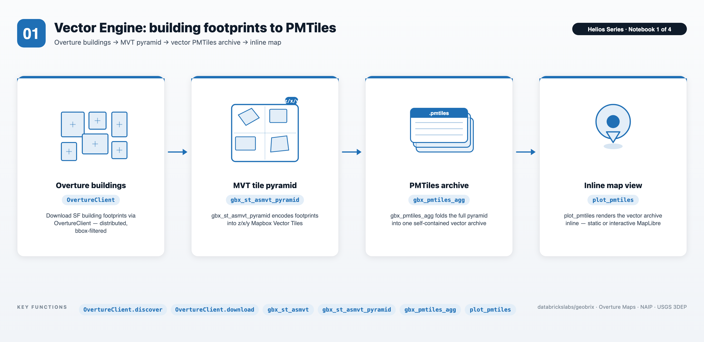
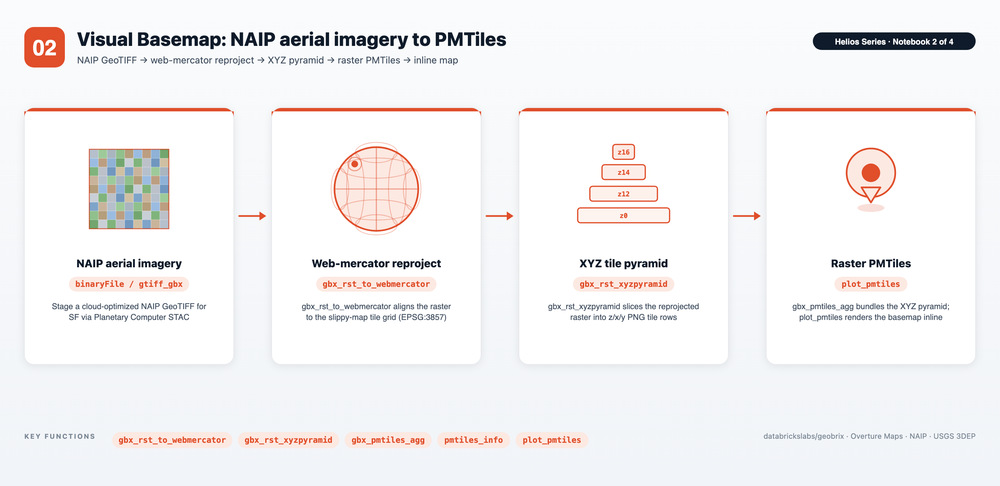
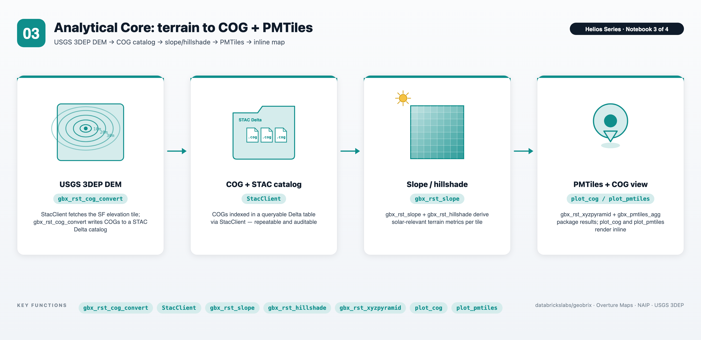
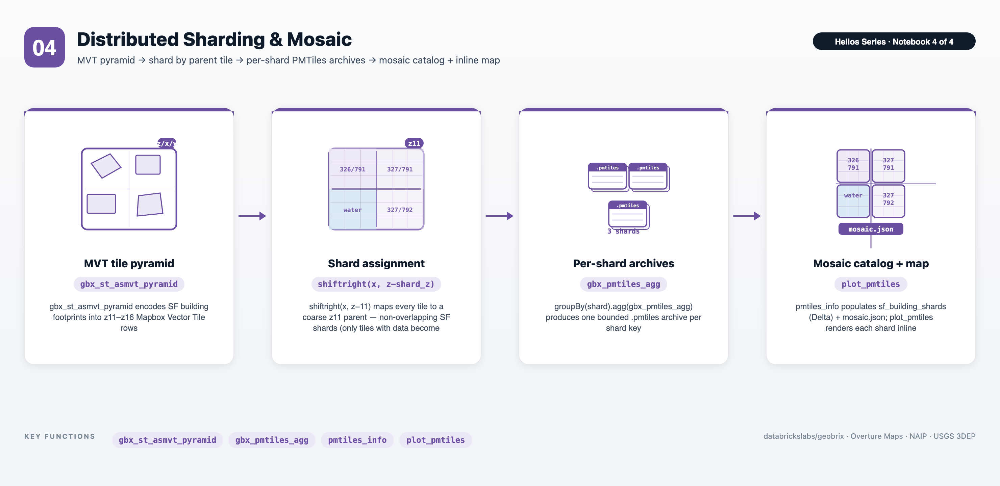

# Helios — Distributed Tiling to PMTiles

A four-notebook series that takes one San Francisco bounding box and turns it into self-contained [PMTiles](https://protomaps.com/docs/pmtiles) archives — one per data modality — then shards a layer into a multi-archive mosaic for web-scale delivery, using [GeoBrix](https://databrickslabs.github.io/geobrix/) on Databricks.


*A multi-layer interactive map (buildings + H3 grid) rendered by `plot_interactive` — self-contained MapLibre, no tile server.*

The notebooks follow a solar site-selection narrative: identify candidate rooftops (vector, NB01), overlay an aerial basemap for visual validation (raster, NB02), and layer terrain-derived slope, aspect, and hillshade to score each candidate by sun exposure (elevation, NB03). A final notebook re-publishes the vector layer as a distributed, sharded PMTiles mosaic — many archives plus a catalog and manifest — for web-scale delivery (NB04). The single-archive outputs feed a single `plot_pmtiles` / `plot_cog` viewer at the end.

> **Lightweight tier (Serverless) by default.** The series uses the lightweight tier — pure Python/PySpark bindings (`databricks.labs.gbx.pyrx`, `pyvx`) plus the `geobrix[light,stac,vizx,overture]` wheel installed by `config_nb` — so it runs on Serverless with no JAR. STAC discovery and download are handled by `StacClient` from `databricks.labs.gbx.stac` (see [STAC Client](https://databrickslabs.github.io/geobrix/docs/api/stac)); building footprints are fetched via `OvertureClient` from `databricks.labs.gbx.sample.overture`; visualization helpers come from `databricks.labs.gbx.vizx`. To run heavyweight instead, flip the commented *option-2* (`rasterx`) in `config_nb.ipynb` and attach the GeoBrix JAR + [GDAL init script](https://databrickslabs.github.io/geobrix/docs/installation) to a classic x86 cluster. See [Execution Tiers](https://databrickslabs.github.io/geobrix/docs/api/execution-tiers).

> **Data sources.** Building footprints are fetched from [Overture Maps](https://overturemaps.org/) via `OvertureClient.discover/download/read` — no manual download required. NAIP aerial imagery and USGS 3DEP 10-m DEMs are retrieved from Planetary Computer and AWS Open Data via notebook helpers; both are staged idempotently to the Volume so a re-run skips already-valid files. NB03 also includes an offline [SRTM](https://www2.jpl.nasa.gov/srtm/) fallback for network-restricted environments.

---

## Notebooks at a glance

### 01 — Vector Engine (MVT)



- **Distributed MVT encoding** — `gbx_st_asmvt` + `gbx_st_asmvt_pyramid` fans out tile generation across the cluster in parallel, producing a full zoom-range MVT pyramid without driver-side loops or single-node bottlenecks.
- **Databricks-native spatial composition** — Databricks built-in `st_area` / `st_centroid` compute per-building roof area and centroid directly on the WKB column; `h3_longlatash3` bins centroids into H3 cells for roof-density scoring. These native functions compose cleanly with GeoBrix MVT encoding — no format conversion required.
- **Single-archive delivery** — `gbx_pmtiles_agg` merges the distributed tile output into one `sf_buildings.pmtiles` archive on the Volume; `show_pmtiles` (from `gbx.vizx`) renders it inline.

### 02 — Visual Basemap (XYZ)



- **Distributed Web Mercator reprojection** — `gbx_rst_to_webmercator` reprojects each NAIP scene across the cluster to the standard slippy-map CRS, scaling linearly with tile count rather than running serially on the driver.
- **Full-resolution XYZ pyramid** — `gbx_rst_xyzpyramid` generates all zoom levels in a single distributed pass, matching the zoom range of the vector layer above.
- **Raster PMTiles** — `gbx_pmtiles_agg` writes the XYZ tile set into `sf_naip.pmtiles`; `show_pmtiles` renders it inline. With `INTERACTIVE_PLOTS = True`, `plot_interactive([pmtiles_layer(naip), pmtiles_layer(buildings)])` layers the aerial basemap under the NB01 building footprints in a single MapLibre map (buildings layer degrades gracefully if NB01 has not run).

### 03 — Analytical Core (COG + STAC)



- **COG conversion + STAC Delta catalog** — `gbx_rst_cog_convert` converts raw 3DEP DEMs to Cloud-Optimized GeoTIFFs in a distributed pass; the resulting COG paths are written to a managed STAC Delta table that `StacClient` can query for incremental updates and downstream notebooks.
- **Terrain analytics at scale** — `gbx_rst_slope`, `gbx_rst_aspect`, and `gbx_rst_hillshade` derive terrain layers in parallel across all DEM tiles; `gbx_rst_xyzpyramid` + `gbx_pmtiles_agg` package the hillshade into `sf_hillshade.pmtiles`. With `INTERACTIVE_PLOTS = True`, `plot_interactive` layers the hillshade and the NB01 building footprints as PMTiles and the H3 `solar_score` as a grid layer — all in one MapLibre map.
- **Databricks-native solar scoring** — `gbx_rst_h3_rastertogridavg` bins slope and aspect rasters into H3 cells; the resulting per-cell values are joined and scored with native Databricks SQL expressions to produce a `solar_score` column. `h3_centeraswkb` reconstructs geometry for map rendering — all without leaving the warehouse.

### 04 — Distributed Sharding & Mosaic



- **Spatial sharding into parallel work units** — each pyramid tile is assigned to a coarse parent tile (z11) via `shiftright(x, z-11)`, then `groupBy(shard).agg(gbx_pmtiles_agg(...))` fans archive packing out across the cluster — one `.pmtiles` per shard instead of one monolithic file. The SF AOI splits into four shards.
- **Shard catalog + mosaic manifest** — a `sf_building_shards` Delta table maps each shard key to its archive path and bounds (`pmtiles_info`), and a `mosaic.json` manifest lets a client discover and assemble the shards with no tile server.
- **Web-scale delivery pattern** — buffering the source query while keeping output tiles non-overlapping across shards keeps boundaries clean and avoids double-rendering; the mosaic pattern scales a single AOI into the per-file size range that object stores and CDNs serve efficiently.

---

## Files

| File | Purpose |
|---|---|
| `config_nb.ipynb` | Shared setup (`%run ./config_nb` from every main notebook). Installs the `geobrix[light,stac,vizx,overture]` wheel (2-step: `--no-deps` first, then with extras), selects the tier (option-1 `pyrx`/`pyvx` default / option-2 heavyweight), registers functions and light readers/writers, imports visualization helpers (`plot_pmtiles`, `plot_cog`, `pmtiles_info`), sets `catalog_name` / `schema_name`, creates the `/Volumes/<cat>/<schema>/data/sf` ETL tree, instantiates `OvertureClient` and `StacClient`, and exposes `FORCE_REBUILD` and `INTERACTIVE_PLOTS` toggles. |
| `01. Vector Engine (MVT).ipynb` | Loads SF building footprints via `OvertureClient`, computes roof area and H3 roof density with Databricks built-in ST/H3 functions, encodes MVT tiles with `gbx_st_asmvt` + `gbx_st_asmvt_pyramid`, and packages the result into `sf_buildings.pmtiles` with `gbx_pmtiles_agg`. |
| `02. Visual Basemap (XYZ).ipynb` | Downloads NAIP aerial imagery for the SF AOI, reprojects to Web Mercator with `gbx_rst_to_webmercator`, generates an XYZ tile pyramid with `gbx_rst_xyzpyramid`, and writes `sf_naip.pmtiles` with `gbx_pmtiles_agg`. |
| `03. Analytical Core (COG + STAC).ipynb` | Downloads 3DEP (or SRTM) DEMs, converts them to COGs with `gbx_rst_cog_convert`, builds a STAC Delta catalog, derives slope/aspect/hillshade, packages `sf_hillshade.pmtiles`, and computes a per-H3-cell `solar_score` with `gbx_rst_h3_rastertogridavg` + native Databricks SQL. |
| `04. Distributed Sharding & Mosaic.ipynb` | Re-publishes the SF buildings vector layer as a **multi-archive** PMTiles mosaic: assigns each pyramid tile to a coarse parent shard (z11), packs one `.pmtiles` per shard with `groupBy(shard).agg(gbx_pmtiles_agg)`, and writes a `sf_building_shards` Delta catalog + `mosaic.json` manifest (bounds via `pmtiles_info`) for client-side mosaic assembly. Includes an offline fallback so it runs without network access. |

---

## Prerequisites

- **Databricks Runtime 17.3 LTS / 18 LTS, or Serverless** (Scala 2.13 / Spark 4 / Python 3.12). The lightweight default runs on Serverless (set Environment to version 5+); the heavyweight option requires a classic x86 cluster.
- **GeoBrix 0.4.0.** `config_nb.ipynb` `%pip`-installs `geobrix[light,stac,vizx,overture]` from a staged Volume wheel using the 2-step pattern (force-reinstall `--no-deps` first, then with the extra to pick up dependencies). For the heavyweight option, flip *option-2* in `config_nb.ipynb` and attach the GeoBrix JAR + GDAL init script to the cluster.
- **Unity Catalog.** Edit `config_nb.ipynb` to set `catalog_name` and `schema_name`. A Volume named `data` must already exist under `<catalog>/<schema>` — the notebooks create sub-directories inside it but will not create the Volume itself.
- **Network access.** NB01 reads Overture Maps via `OvertureClient`; NB02 fetches NAIP from AWS Open Data; NB03 fetches 3DEP from Planetary Computer (SRTM offline fallback available). Classic cluster outbound internet is sufficient; Serverless has it by default.

---

## Run order

1. Open `config_nb.ipynb`, set `catalog_name` / `schema_name`, and verify the Volume exists.
2. Run notebooks in numeric order: **01 → 02 → 03 → 04**. Each notebook starts with `%run ./config_nb` so the shared state is re-established every time. NB04 reuses NB01's building footprints (and falls back to an offline synthetic set if NB01 hasn't run).

Each notebook is safe to re-run — outputs are written with skip-guards so already-built files are not re-downloaded or re-tiled. Set `FORCE_REBUILD = True` in a cell right after `%run ./config_nb` to force a full rebuild of that notebook's outputs.

The notebooks ship with `INTERACTIVE_PLOTS = False` so the committed `.ipynb` renders fast static maps on GitHub; set `INTERACTIVE_PLOTS = True` (in `config_nb` or in a cell after `%run`) for interactive MapLibre multi-layer maps.

---

## Data flow

```
San Francisco AOI (one bbox, reused across all three notebooks)
        │
  ┌─────┴───────────────┬─────────────────────────────┐
  ▼                     ▼                             ▼
Overture buildings    NAIP aerial (helper)         USGS 3DEP DEM (helper)
(OvertureClient)       │                             │
  │                    ▼ gbx_rst_to_webmercator      ▼ gbx_rst_cog_convert
  ▼ gbx_st_asmvt        │                             │  → COGs + STAC Delta
    + st_asmvt_pyramid  ▼ gbx_rst_xyzpyramid          ▼ slope/aspect/hillshade
  │                    │                             ▼ gbx_rst_xyzpyramid
  ▼ gbx_pmtiles_agg     ▼ gbx_pmtiles_agg             ▼ gbx_pmtiles_agg
sf_buildings.pmtiles   sf_naip.pmtiles              sf_hillshade.pmtiles
  │                     │                             │
  └─────────────────────┴──────────────┬──────────────┘
                                        ▼
                          plot_pmtiles / plot_cog (inline)
                            → solar site-selection view
```

---

## Serverless execution strategy

This series defaults to the lightweight tier so it runs on **Serverless** — set the notebook **Environment to version 5+** (Python 3.12) so the `[light]` dependencies resolve. Serverless changes a few habits vs. a classic cluster, and the notebooks lean on these patterns deliberately:

- **No runtime `spark.conf` tuning.** Serverless disallows `spark.conf.set(...)`, so the notebooks do not call it. To control parallelism, use **`DataFrame.repartition(N, col)`** — a number-only `repartition(N)` (round-robin) is AQE-coalesced back toward ~1 partition on small data (effectively serial), but a **hash repartition by a column** is respected. The explicit `repartition(N, key)` before each expensive UDF is deliberate.
- **No `.cache()` / `persist()`.** Not available on Serverless; where caching would normally be used, the notebooks write to a managed Delta table and read it back — also the production-friendly choice.
- **Volume I/O is sequential-only.** UC Volume FUSE cannot serve random/seeked reads. Downloads write to Volume paths sequentially, and any raster staging to worker-local disk uses sequential copies. Downloaded files are read-validated before being published, so truncated responses are caught and retried rather than silently accepted.

---

## Key GeoBrix / Databricks functions shown

- **GeoBrix VectorX** (`pyvx` / SQL): `gbx_st_asmvt`, `gbx_st_asmvt_pyramid`, `gbx_pmtiles_agg` (single-archive, and grouped `groupBy(shard).agg(gbx_pmtiles_agg)` for a sharded mosaic in NB04).
- **GeoBrix RasterX** (`pyrx` / SQL): `gbx_rst_to_webmercator`, `gbx_rst_xyzpyramid`, `gbx_rst_cog_convert`, `gbx_rst_slope`, `gbx_rst_aspect`, `gbx_rst_hillshade`, `gbx_rst_h3_rastertogridavg`.
- **GeoBrix STAC + Overture**: `OvertureClient.discover` / `download` / `read`; `StacClient` (search, download, repair).
- **GeoBrix VizX**: `plot_pmtiles`, `plot_cog`, `pmtiles_info`, `show_pmtiles`.
- **Databricks built-in ST / H3** (on-ramp to native): `st_geomfromwkb`, `st_area`, `st_centroid` (roof metrics, NB01); `h3_longlatash3` (roof density, NB01); `h3_centeraswkb` (H3 solar-suitability cell geometry, NB03).

---

## Gotchas

- **PMTiles is driver-side only.** `gbx_pmtiles_agg` produces the archive via a distributed reduce but the final file lands on the driver Volume path — it cannot be read back via `spark.read`. Use `pmtiles_info` / `plot_pmtiles` for inspection.
- **Overture cloud-path vs. HTTP-href.** `OvertureClient` first tries a direct cloud-storage path; if that is not reachable from the cluster network it falls back to an HTTP href. Classic clusters with S3 VPC endpoints reach the cloud path; Serverless always reaches the HTTP href.
- **NAIP and 3DEP network reachability.** Both sources require outbound internet access. On restricted networks, the SRTM offline fallback in NB03 covers the terrain layer; NAIP has no offline fallback and NB02 will skip if the endpoint is unreachable.
- **`plot_pmtiles` base64 size guard.** Embedding a PMTiles archive inline as base64 is capped at ~64 MB. Archives larger than that fall back to a static thumbnail. Scope the AOI or zoom range if the archive exceeds the cap.
- **Repartition by column on Serverless.** A number-only `repartition(N)` is AQE-coalesced on Serverless. Always repartition by a data column (e.g., `repartition(N, "tile_x")`) before distributed UDF calls. See [Serverless execution strategy](#serverless-execution-strategy) above.
- **Wheel install is a 2-step pattern.** `config_nb` installs the wheel with `--no-deps` first (to force fresh bytes), then reinstalls with `geobrix[light,stac,vizx,overture]` (to pull extras). A bare single-step `--no-deps` install drops the extras and causes `ModuleNotFoundError` at import.

---

## Related resources

- [Helios series docs page](https://databrickslabs.github.io/geobrix/docs/notebooks/helios)
- [EO Series](../eo-series/README.md) — STAC discovery to gridded H3 rasters (Sentinel-2 / Alaska)
- [RasterX API](https://databrickslabs.github.io/geobrix/docs/api/rasterx)
- [VectorX API](https://databrickslabs.github.io/geobrix/docs/api/vectorx)
- [VizX API](https://databrickslabs.github.io/geobrix/docs/api/vizx)
- [PMTiles API](https://databrickslabs.github.io/geobrix/docs/api/pmtiles)
- [Execution Tiers](https://databrickslabs.github.io/geobrix/docs/api/execution-tiers)
- [STAC Client](https://databrickslabs.github.io/geobrix/docs/api/stac)
