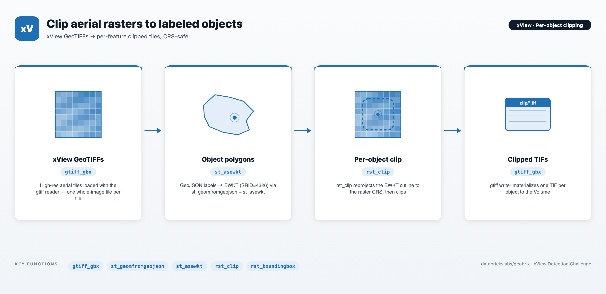

# Clipping - xView — Per-Object Raster Clipping with GeoBrix

An end-to-end example showing how to load high-resolution aerial GeoTIFFs from the [xView Detection Challenge](https://challenge.xviewdataset.org/) dataset into Lakehouse tables and clip rasters to labeled objects in the accompanying GeoJSON, using GeoBrix RasterX together with Databricks built-in Spatial SQL functions.

The single notebook moves from raw xView TGZ archives → a raster table loaded by the built-in `gtiff` reader → GeoJSON-derived object table (EWKT with SRID) → per-object clipped tiles, written back to a Unity Catalog Volume as individual TIFs by the built-in `gtiff` writer.



> **Runs on the lightweight tier (Serverless) by default.** The notebook uses the lightweight tier — pure Python/PySpark bindings (`databricks.labs.gbx.pyrx`) plus the `geobrix[light]` wheel — so it runs on Serverless with no JAR. To run it on the heavyweight tier instead, make a few tweaks: swap the import to `databricks.labs.gbx.rasterx` (the commented *option-2* in the setup cell) and, on a classic x86 cluster, attach both the GeoBrix JAR and the [GDAL init script](https://databrickslabs.github.io/geobrix/docs/installation) that installs the native GDAL libraries the JNI bindings load. Either way the preview cells need `rasterio` — install it directly (`%pip install rasterio`) or pull it in via the `geobrix[light]` extra. See [Execution Tiers](https://databrickslabs.github.io/geobrix/docs/api/execution-tiers).

---

## Files

| File | Purpose |
|---|---|
| `Clipping - xView.ipynb` | The full pipeline. Sets up the catalog / schema / Volume, downloads + extracts the xView training TGZ and label GeoJSON to `/Volumes/<cat>/<schema>/data/`, loads rasters with the `gtiff` reader (one whole-image tile per `.tif`), builds an object table from `xView_train.geojson` via `st_geomfromgeojson` + `st_asewkt`, joins objects to their source tiles, applies `rst_clip(tile, wkt_clip, True)` with EWKT-encoded polygons, and writes the clipped rasters back to the Volume with the `gtiff` writer as `<index_right>_<type_id>_<feature_id>.tif`. |

---

## Prerequisites

- **Databricks Runtime 17.3 LTS / 18 LTS, or Serverless** (Scala 2.13 / Spark 4 / Python 3.12). The lightweight default runs on Serverless; the heavyweight tweak needs a classic x86 cluster.
- **GeoBrix** (version 0.4.0). The setup cell `%pip`-installs the `geobrix[light]` wheel, which brings the pure-Python bindings (`databricks.labs.gbx.pyrx`) and their dependencies (including `rasterio`, used for the in-notebook previews). For the heavyweight tweak, also attach the GeoBrix JAR **and the GDAL init script** to the cluster, and switch the import to `databricks.labs.gbx.rasterx`.
- **Unity Catalog**: set `catalog_name` / `schema_name` at the top of the notebook. A Volume named `data` must already exist under `<catalog>/<schema>`; the notebook will create the schema but not the Volume.
- **xView account**: you need a free account at [challenge.xviewdataset.org](https://challenge.xviewdataset.org/) to obtain session-based download links for `xView_train.tgz` (training imagery) and the labels archive. Paste those URLs into the `train_url` / `labels_url` cells before running the download step.
- **Compute sizing**: xView training tiles are ~3000×3000 RGB GeoTIFFs. For the heavyweight tier, an x86 cluster is required for the GDAL JNI natives, and memory/disk-optimized variants (e.g. `r6id.*`, `m5d.*`) are recommended for the raster-processing step.

---

## Pipeline

```
xView train TGZ + xView_train.geojson  (session-signed downloads)
          │
          ▼  download_extract → /Volumes/<cat>/<schema>/data/{train_images, train_labels}
gtiff reader over train_images/*.tif  (one whole-image tile per file)
          │
          ▼  + rst_boundingbox + rst_srid                 →  xview_raster
GeoJSON objects (features)
          │
          ▼  st_geomfromgeojson → st_asewkt (SRID=4326)   →  xview_object
Join objects to rasters on image_file (basename)
          │
          ▼  rst_clip(tile, wkt_clip, True)                →  xview_object_clip
gtiff writer (nameCol)
          │
          ▼  /Volumes/<cat>/<schema>/data/clip/<index_right>_<type_id>_<feature_id>.tif
```

---

## Key GeoBrix / Databricks functions shown

- **GeoBrix RasterX** (`rx.rst_*`): `rst_boundingbox`, `rst_srid`, `rst_summary`, `rst_clip` (with EWKT input).
- **Databricks built-in ST** (`DBF.*`): `st_geomfromgeojson`, `st_asewkt` — used to emit each feature's polygon as `SRID=4326;POLYGON(...)` so that the SRID travels with the WKT into `rst_clip`.
- **Readers**: the GeoBrix `gtiff` reader (`format("gtiff_gbx")`) loads each `.tif` straight into a `tile` column — the default `sizeInMB=-1` means no windowed split, i.e. one whole-image tile per file, so every label clips against the single tile that contains it; `json` (multiline) reads the xView labels GeoJSON. Readers/writers are installed by `register(spark)`.
- **Writers**: the GeoBrix `gtiff` writer (`format("gtiff_gbx")`) materializes clipped TIFs as individual files on the Volume; `nameCol` points at the `source` column for deterministic `<index_right>_<type_id>_<feature_id>.tif` names.

---

## Gotchas

- **xView is session-signed**: download links from `challenge.xviewdataset.org` are time-limited. If `download_extract` hangs or returns tiny files, regenerate your links and re-run — the helper cleans `/tmp` on each run, so it is safe to retry.
- **Pass `[E]WKT` strings or `[E]WKB` bytes — not native geometry columns**: `rst_clip` expects a `String`/`Binary` column. Do **not** pass `st_geomfromtext(...)` / `st_geomfromwkb(...)` / DBR geometry or geography types directly. Serialize with `st_asewkt` (preferred — carries SRID) or `st_aswkb` / `st_asewkb` first.
- **Prefer EWKT/EWKB for `rst_clip` (SRID handling)**: **EWKT/EWKB is the recommended input** because the SRID travels with the geometry, so `rst_clip` reprojects the cutline to the raster CRS automatically when they differ. Plain **WKT**/**WKB** (no SRID) is assumed to already be in the raster's CRS and is **not reprojected** — silently wrong if it isn't. xView imagery is EPSG:4326, and `st_asewkt(st_geomfromgeojson(...))` emits `SRID=4326;...`, so the two match for this dataset — but EWKT keeps the pipeline correct when sources differ.
- **`gtiff` writer enforces an exact `(source, tile)` schema**: to control output filenames, set `nameCol` and put the desired basename in `source` (the writer emits `<source>.tif`). Drop any extra columns down to exactly `source` + `tile` before `.save(...)` — extras or a missing column both fail.
- **Filter before clipping for demo runs**: `xview_object` contains hundreds of thousands of features across 60+ classes. The notebook filters to `type_name = 'Yacht'` (type_id=50) before the join + clip so the demo finishes quickly. Remove the filter for a full materialization.
- **Class label dictionary is inline**: `xv_type_dict` is copied from the [xView baseline repo](https://github.com/DIUx-xView/xView1_baseline/blob/master/xview_class_labels.txt); update it if xView publishes new classes.
